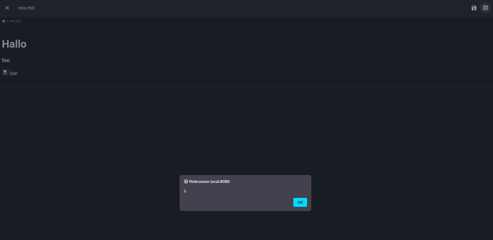

# Filebrowser Stored Cross-Site Scripting #

## Vulnerability Overview ##

The Markdown preview function of Filebrowser is vulnerable to *Stored
Cross-Site-Scripting (XSS)*. Any JavaScript code that is part of a Markdown
file uploaded by a user will be executed by the browser.

* **Identifier**            : SBA-ADV-20250325-04
* **Type of Vulnerability** : Stored XSS
* **Software/Product Name** : [Filebrowser](https://filebrowser.org/)
* **Vendor**                : [Filebrowser](https://github.com/filebrowser)
* **Affected Versions**     : <= 2.33.6
* **Fixed in Version**      : 2.33.7
* **CVE ID**                : CVE-2025-52902
* **CVSS Vector**           : CVSS:3.1/AV:N/AC:L/PR:L/UI:R/S:C/C:H/I:L/A:N
* **CVSS Base Score**       : 7.6 (High)

## Vendor Description ##

> filebrowser provides a file managing interface within a specified directory
> and it can be used to upload, delete, preview, rename and edit your files.
> It allows the creation of multiple users and each user can have its own
> directory. It can be used as a standalone app.

Source: <https://github.com/filebrowser/filebrowser/blob/v2.32.0/README.md>

## Impact ##

A user can upload a malicious Markdown file to the application which can
contain arbitrary HTML code. If another user within the same scope clicks on
that file, a rendered preview is opened. JavaScript code that has been
included will be executed.

Malicious actions that are possible include:

* Obtaining a user's session token
* Elevating the attacker's privileges, if the victim is an administrator
  (e.g., gaining command execution rights)

## Vulnerability Description ##

Most Markdown parsers accept arbitrary HTML in a document and try rendering
it accordingly. For instance, if one creates a file called `xss.md` with the
following content

```markdown
# Hallo

<b>foo</b>


<i>bar</i>
```

bold and italic text will be rendered. Also, the renderer used in Filebrowser
will try to display the image and execute the code in the `onerror` event
handler.

## Proof of Concept ##

The screenshot shows that the code from the file mentioned above has
actually been executed in the victim's browser:



## Recommended Countermeasures ##

The most thorough fix would be to reconfigure the application's Markdown
parser to ignore all HTML elements and only render rich text which is part of
the Markdown specification. If HTML rendering is considered to be a required
feature, an HTML sanitizer like DOMPurify should be used, preferably in
conjunction with a *Content Security Policy* (CSP).

## Timeline ##

* `2025-03-25` Identified the vulnerability in version 2.32.0
* `2025-04-11` Contacted the project
* `2025-04-18` Vulnerability disclosed to the project
* `2025-06-25` Uploaded advisories to the project's GitHub repository
* `2025-06-26` CVE ID assigned by GitHub
* `2025-06-26` Fix released with version 2.33.7
* `2025-06-26` Advisory published by project as `GHSA-4wx8-5gm2-2j97`

## References ##

* DOMPurify: <https://github.com/cure53/DOMPurify>
* GitHub Security Advisory: <https://github.com/filebrowser/filebrowser/security/advisories/GHSA-4wx8-5gm2-2j97>

## Credits ##

* Mathias Tausig ([SBA Research](https://www.sba-research.org/))
