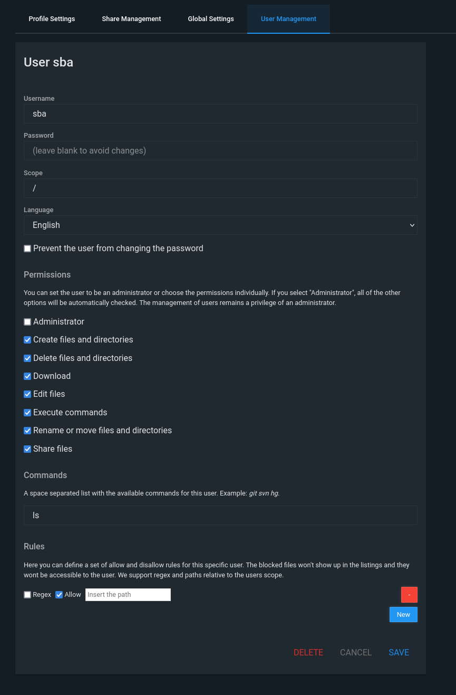
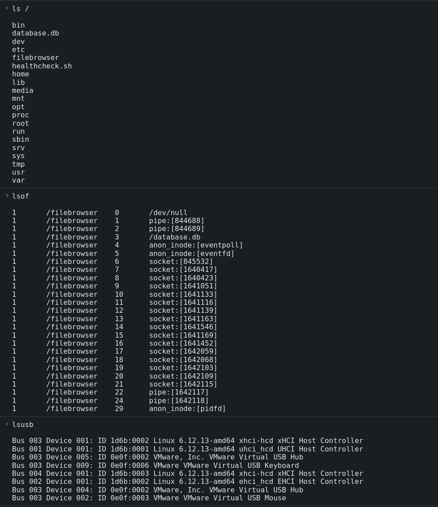

# Filebrowser Command Execution Allowlist Bypass #

## Vulnerability Overview ##

The *Command Execution* feature of Filebrowser only allows the execution of
shell commands which have been predefined on a user-specific allowlist. The
implementation of this allowlist is erroneous, allowing a user to execute
additional commands not permitted.

* **Identifier**            : SBA-ADV-20250325-05
* **Type of Vulnerability** : Remote Code Execution
* **Software/Product Name** : [Filebrowser](https://filebrowser.org/)
* **Vendor**                : [Filebrowser](https://github.com/filebrowser)
* **Affected Versions**     : <= 2.33.9
* **Fixed in Version**      : 2.33.10
* **CVE ID**                : CVE-2025-52995
* **CVSS Vector**           : CVSS:3.1/AV:N/AC:H/PR:H/UI:N/S:C/C:H/I:H/A:H
* **CVSS Base Score**       : 8.0 (High)

## Vendor Description ##

> filebrowser provides a file managing interface within a specified directory
> and it can be used to upload, delete, preview, rename and edit your files.
> It allows the creation of multiple users and each user can have its own
> directory. It can be used as a standalone app.

Source: <https://github.com/filebrowser/filebrowser/blob/v2.32.0/README.md>

## Impact ##

A user can execute more shell commands than they are authorized for. The
concrete impact of this vulnerability depends on the commands configured, and
the binaries installed on the server or in the container image. Due to the
missing separation of *scopes* on the OS-level, this could give an attacker
access to all files managed the application, including the Filebrowser
database.

## Vulnerability Description ##

For a user to make use of the command execution feature, two things need to
happen in advance:

1. An administrator needs to grant that account the `Execute commands` permission
2. The command to be executed needs to be listed in the `Commands` input
   field (also done by an administrator)

If a user tries to execute a different command, it gets rejected by the application.

The allowlist verification of a command happens in the function `CanExecute`
in the file `users/users.go`:

```go
// CanExecute checks if an user can execute a specific command.
func (u *User) CanExecute(command string) bool {
	if !u.Perm.Execute {
		return false
	}

	for _, cmd := range u.Commands {
		if regexp.MustCompile(cmd).MatchString(command) {
			return true
		}
	}

	return false
}
```

This check employs a regular expression which does not test if the command
issued (`command`) is identical to a configured one (`cmd`, part of the array
`u.Commands`) but rather only if the issued command contains an allowed one.
This has the consequence, that, e.g., if you are only granted access to the
`ls` command, you will also be allowed to execute `lsof` and `lsusb`.

As a prerequisite, an attacker needs an account with the `Execute Commands`
permission and some permitted commands.

## Proof of Concept ##

Grant a user the `Execute commands` permission and allow them to use only
`ls` in the `Commands` field:



Afterwards, login as that user, open a command execution window and execute
`lsof` and `lsusb`:



## Recommended Countermeasures ##

The `CanExecute` function in the Filebrowser source code should be fixed to
only allow exact matches of the command specified instead of doing partial
matching. The correctness of this fix should be extensively tested in the
application's automated test suite.

## Timeline ##

* `2025-03-25` Identified the vulnerability in version 2.32.0
* `2025-04-11` Contacted the project
* `2025-04-18` Vulnerability disclosed to the project
* `2025-06-25` Uploaded advisories to the project's GitHub repository
* `2025-06-26` CVE ID assigned by GitHub
* `2025-06-26` Fix released with version 2.33.10
* `2025-06-30` Advisory published by project as `GHSA-w7qc-6grj-w7r8`

## References ##

* GitHub Security Advisory: <https://github.com/filebrowser/filebrowser/security/advisories/GHSA-w7qc-6grj-w7r8>

## Credits ##

* Mathias Tausig ([SBA Research](https://www.sba-research.org/))
