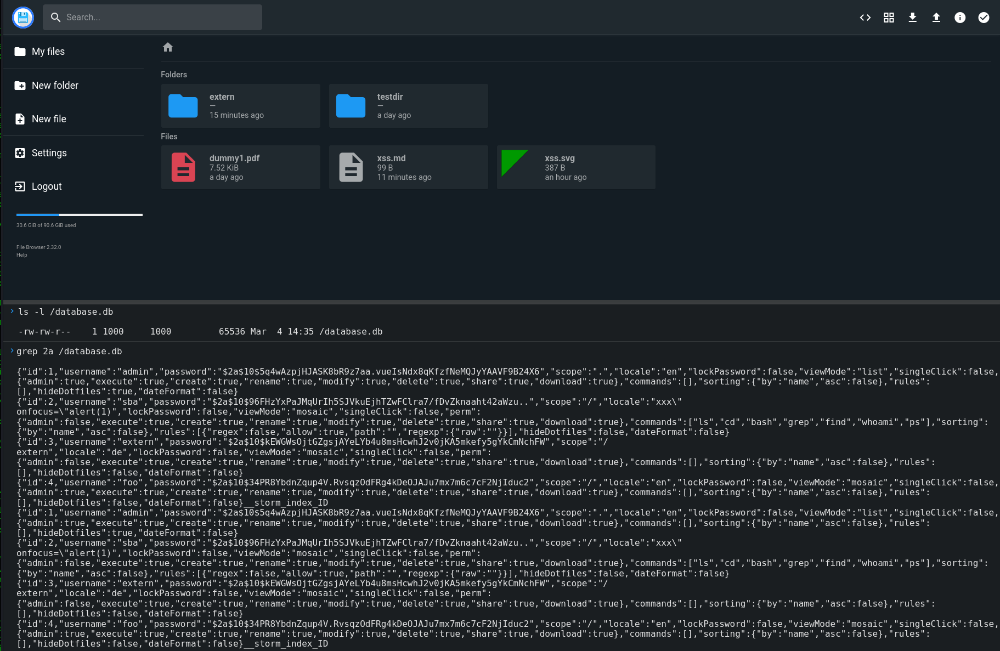

# Filebrowser Command Execution not Limited to Scope #

## Vulnerability Overview ##

In the web application, all users have a *scope* assigned, and they only have
access to the files within that *scope*. The *Command Execution* feature of
Filebrowser allows the execution of shell commands which are not restricted
to the scope, potentially giving an attacker read and write access to all
files managed by the server.

* **Identifier**            : SBA-ADV-20250326-01
* **Type of Vulnerability** : Command Execution not Limited to Scope
* **Software/Product Name** : [Filebrowser](https://filebrowser.org/)
* **Vendor**                : [Filebrowser](https://github.com/filebrowser)
* **Affected Versions**     : <= 2.34.2
* **Fixed in Version**      : Not yet
* **CVE ID**                : CVE-2025-52904
* **CVSS Vector**           : CVSS:3.1/AV:N/AC:H/PR:H/UI:N/S:C/C:H/I:H/A:H
* **CVSS Base Score**       : 8.0 (High)

## Vendor Description ##

> filebrowser provides a file managing interface within a specified directory
> and it can be used to upload, delete, preview, rename and edit your files.
> It allows the creation of multiple users and each user can have its own
> directory. It can be used as a standalone app.

Source: <https://github.com/filebrowser/filebrowser/blob/v2.32.0/README.md>

## Impact ##

Shell commands are executed with the *uid* of the server process without any
further restrictions. This means, that they will have access to at least

* all files managed by the application from all *scopes*, even those the user
 does not have access to in the GUI.
* the Filebrowser database file containing the password hashes of all accounts.

The concrete impact depends on the commands being granted to the attacker,
but due to other vulnerabilities identified ("Bypass Command Execution
Allowlist", "Shell Commands Can Spawn Other Commands", "Insecure File
Permissions") it is likely, that full read- and write-access will exist.

Read access to the database means, that the attacker is capable of extracting
all user password hashes. This enables an offline dictionary attack on the
passwords of all accounts, though the choice of the password hash function
(*bcrypt* with a complexity of 10) gives a strong protection against such
attacks. Write access to the database means that attackers are capable of
changing a user's password hash, allowing them to impersonate any user
account, including an administrator.

## Vulnerability Description ##

Shell commands executed by a user are created as a simple subprocess of the
application without any further restrictions. That means, that they have full
access to files accessible by the application. The *scope* that is assigned
to every account is not considered.

As a prerequisite, an attacker needs an account with the `Execute Commands`
permission and some permitted commands.

## Proof of Concept ##

Any exploit highly depends on the commands granted to the attacker. The
following screenshot shows, how all password hashes can be extracted using
only the `grep` command:

## Recommended Countermeasures ##

Until this issue is fixed, we recommend to completely disable
`Execute commands` for all accounts. Since the command execution is an
inherently dangerous feature that is not used by all deployments, it should
be possible to completely disable it in the application's configuration. As a
defense-in-depth measure, organizations not requiring command execution
should operate the Filebrowser from a *distroless* container image.

There are two approaches to fixing this issue:

1. Limiting the process when it is started e.g., by using *user namespaces*
   with a tool like *Bubblewrap*. If this path is chosen, it is important to
   use a method that works both on a bare-metal server and within an
   unprivileged container.
2. Re-architecting the command execution feature so that file in the various
   *scopes* have a distinct *uid* as an owner and all shell command are
   executed under the *uid* of the user's *scope*.

## Timeline ##

* `2025-03-26` Identified the vulnerability in version 2.32.0
* `2025-04-11` Contacted the project
* `2025-04-18` Vulnerability disclosed to the project
* `2025-06-25` Uploaded advisories to the project's GitHub repository
* `2025-06-26` CVE ID assigned by GitHub
* `2025-06-26` Advisory published by project as `GHSA-hc8f-m8g5-8362`; the
  issue itself won't be fixed, but command execution has been disabled by
  default in version 2.33.8 as a workaround; GitHub issue #5199 opened to
  track the fix

## References ##

* Sandboxing Applications with Bubblewrap: Securing a Basic Shell: <https://sloonz.github.io/posts/sandboxing-1/>
* "Distroless" Container Images: <https://github.com/GoogleContainerTools/distroless>
* GitHub Security Advisory: <https://github.com/filebrowser/filebrowser/security/advisories/GHSA-hc8f-m8g5-8362>
* GitHub Issue: <https://github.com/filebrowser/filebrowser/issues/5199>

## Credits ##

* Mathias Tausig ([SBA Research](https://www.sba-research.org/))
