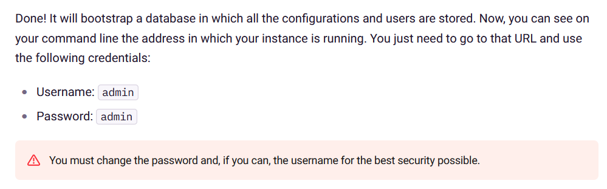

# Filebrowser Insecure Password Handling #

## Vulnerability Overview ##

All user accounts authenticate towards a Filebrowser instance with a
password. A missing password policy and brute-force protection makes it
impossible for administrators to properly secure the authentication process.

* **Identifier**            : SBA-ADV-20250327-01
* **Type of Vulnerability** : Weak Authentication
* **Software/Product Name** : [Filebrowser](https://filebrowser.org/)
* **Vendor**                : [Filebrowser](https://github.com/filebrowser)
* **Affected Versions**     : <= 2.34.0
* **Fixed in Version**      : 2.34.1
* **CVE ID**                : CVE-2025-52997
* **CVSS Vector**           : CVSS:3.1/AV:N/AC:H/PR:N/UI:N/S:U/C:H/I:N/A:N
* **CVSS Base Score**       : 5.9 (Medium)

## Vendor Description ##

> filebrowser provides a file managing interface within a specified directory
> and it can be used to upload, delete, preview, rename and edit your files.
> It allows the creation of multiple users and each user can have its own
> directory. It can be used as a standalone app.

Source: <https://github.com/filebrowser/filebrowser/blob/v2.32.0/README.md>

## Impact ##

Attackers can mount a brute-force attack against the passwords of all
accounts of an instance. Since the application is lacking the ability to
prevent users from choosing a weak password, the attack is likely to succeed.

## Vulnerability Description ##

The application implements a classical authentication scheme using a username
and password combination. While employed by many systems, this scheme is
quite error-prone and a common cause for vulnerabilities. Filebrowser's
implementation has multiple weak points:

1. Since the application is missing the capability for administrators to
   define a password policy, users are at liberty to set trivial and
   well-known passwords such as `secret` or even ones with only single digit
   like `1`.
2. New instances are set up with a default password of `admin` for the
   initial administrative account. This password is well known and easily
   guessable. While the documentation advises to change this password, the
   application does not technically enforce it.
3. The application does not implement any brute-force protection for the
   authentication endpoint. Attackers can make as many guesses for a password
   as the network bandwidth allows.

The combination of these problems makes it likely, that an attacker will
succeed in compromising at least one account in a Filebrowser instance,
possibly even one with administrative privileges. The likelihood of such an
attack increases substantially for internet-facing instances.

## Proof of Concept ##

The insecure default credentials are documented on the application's website:



The following HTTP communication shows, that a trivial password of `1` can be
configured by a user:

```http hl:11
PUT /api/users/2 HTTP/1.1
Host: filebrowser.local:8080
Referer: http://filebrowser.local:8080/settings/profile
X-Auth: eyJ[...]
Content-Type: text/plain;charset=UTF-8
Content-Length: 319
Origin: http://filebrowser.local:8080
Cookie: auth=eyJ[...]
[...]

{"what":"user","which":["password"],"data":{"id":2,"locale":"en","viewMode":"mosaic","singleClick":false,"perm":{"admin":false,"execute":true,"create":true,"rename":true,"modify":true,"delete":true,"share":true,"download":true},"commands":[],"lockPassword":false,"hideDotfiles":false,"dateFormat":false,"password":"1"}}

HTTP/1.1 200 OK
Cache-Control: no-cache, no-store, must-revalidate
Content-Security-Policy: default-src 'self'; style-src 'unsafe-inline';
Content-Type: text/plain; charset=utf-8
X-Content-Type-Options: nosniff
Date: Thu, 27 Mar 2025 08:31:34 GMT
Content-Length: 7

200 OK
```

The missing brute-force protection can easily be tested by repeatedly sending
the following request to the application with a tool such as Burp or hydra.

```http
POST /api/login HTTP/1.1
Host: filebrowser.local:8080
Content-Type: application/json
Content-Length: 52
Origin: http://filebrowser.local:8080
[...]

{"username":"admin","password":"myPasswordGuess","recaptcha":""}

HTTP/1.1 403 Forbidden
Cache-Control: no-cache, no-store, must-revalidate
Content-Security-Policy: default-src 'self'; style-src 'unsafe-inline';
Content-Type: text/plain; charset=utf-8
X-Content-Type-Options: nosniff
Date: Thu, 27 Mar 2025 08:39:48 GMT
Content-Length: 14

403 Forbidden
```

After sending 3000 bad passwords to the application within a few seconds, a
successful authentication is still possible for the account:

```http
POST /api/login HTTP/1.1
Host: filebrowser.local:8080
Content-Type: application/json
Content-Length: 54
Origin: http://filebrowser.local:8080
[...]

{"username":"admin","password":"myCorrectPassword","recaptcha":""}

HTTP/1.1 200 OK
Cache-Control: no-cache, no-store, must-revalidate
Content-Security-Policy: default-src 'self'; style-src 'unsafe-inline';
Content-Type: text/plain
Date: Thu, 27 Mar 2025 08:39:58 GMT
Content-Length: 508

eyJ[...]
```

## Recommended Countermeasures ##

The application should add an option to define a password policy in its
administrative interface which allows to set a minimum length for passwords.
The default settings should be in line with the NIST publication SP 800-63B.
This means, that passwords of fewer than 8 characters should never be
allowed by the application. Whenever a user sets a new password, the
application should verify whether that password is part of a "known
passwords" list.

The application should either create a secure and random password for the
`admin` account upon initialization or enforce an immediate password change
when that user logs in for the first time using the default password.

A brute-force protection needs to be implemented, which limits the allowed
amount of authentication attempts per user within a certain timeframe. This
implementation should employ *device tokens* to prevent targeted lockout
attacks.

In addition, it would be advisable to allow the integration of the
application into and existing *Identity Provider* using protocols like LDAP
or OIDC.

## Timeline ##

* `2025-03-27` Identified the vulnerability in version 2.32.0
* `2025-04-11` Contacted the project
* `2025-04-29` Vulnerability disclosed to the project
* `2025-06-25` Uploaded advisories to the project's GitHub repository
* `2025-06-26` CVE ID assigned by GitHub
* `2025-06-29` Fix released with version 2.34.1. Brute-Force protection has
  not been implemented, instead a recommendation to configure fail2ban has
  been added the documentation
* `2025-06-30` Advisory published by project as `GHSA-cm2r-rg7r-p7gg`

## References ##

* OWASP Authentication Cheat Sheet: <https://cheatsheetseries.owasp.org/cheatsheets/Authentication_Cheat_Sheet.html#implement-proper-password-strength-controls>
* NIST Special Publication 800-63B. Digital Identity Guidelines. Passwords: <https://pages.nist.gov/800-63-4/sp800-63b.html#password>
* Pwned Passwords: <https://haveibeenpwned.com/Passwords>
* Common Credentials: <https://github.com/danielmiessler/SecLists/tree/master/Passwords/Common-Credentials>
* CWE-307: Improper Restriction of Excessive Authentication Attempts: <https://cwe.mitre.org/data/definitions/307.html>
* CWE-521: Weak Password Requirements: <https://cwe.mitre.org/data/definitions/521.html>
* CWE-1392: Use of Default Credentials: <https://cwe.mitre.org/data/definitions/1392.html>
* GitHub Security Advisory: <https://github.com/filebrowser/filebrowser/security/advisories/GHSA-cm2r-rg7r-p7gg>

## Credits ##

* Mathias Tausig ([SBA Research](https://www.sba-research.org/))
