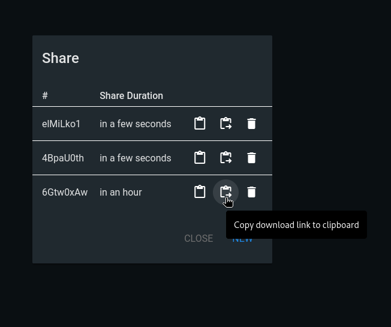

# Filebrowser Password Protection of Links Bypassable #

## Vulnerability Overview ##

Files managed by Filebrowser can be shared with a link to external
persons. While the application allows protecting those links with a password,
the implementation is error-prone, making an incidental unprotected sharing
of a file possible.

* **Identifier**            : SBA-ADV-20250327-02
* **Type of Vulnerability** : Authentication Bypass
* **Software/Product Name** : [Filebrowser](https://filebrowser.org/)
* **Vendor**                : [Filebrowser](https://github.com/filebrowser)
* **Affected Versions**     : <= 2.34.2
* **Fixed in Version**      : Not yet
* **CVE ID**                : CVE-2025-52996
* **CVSS Vector**           : CVSS:3.1/AV:N/AC:H/PR:N/UI:R/S:U/C:L/I:N/A:N
* **CVSS Base Score**       : 3.1 (Low)

## Vendor Description ##

> filebrowser provides a file managing interface within a specified directory
> and it can be used to upload, delete, preview, rename and edit your files.
> It allows the creation of multiple users and each user can have its own
> directory. It can be used as a standalone app.

Source: <https://github.com/filebrowser/filebrowser/blob/v2.32.0/README.md>

## Impact ##

File owners might rest in the assumption that their shared files are only
accessible to persons knowing the defined password, giving them a false sense
of security. Meanwhile, attackers gaining access to the unprotected link can
use this information alone to download the possibly sensitive file.

## Vulnerability Description ##

When sharing a file, the user is presented with a dialog asking for an
optional password to protect the file share. The assumption of the user at
this point would be, that the shared file won't be accessible without
knowledge of the password. After clicking on `SHARE` the following dialog
opens allowing the file's owner to copy the share-link:



In fact, there is not one, but two links offered: A `Download Link` and an
unnamed second one. They have the following format:

* `http://filebrowser.local:8080/share/6Gtw0xAw`
* `http://filebrowser.local:8080/api/public/dl/6Gtw0xAw/dummy1.pdf?token=voDK6j[...]`

Apparently, the first of the two share links is that one that users are
supposed to actually share, while the second one is a direct download link
not protected by the password. This behavior is not documented anywhere or
explained in the GUI, though.

There are multiple scenarios how an attacker might gain access to the
unprotected link and, in consequence, to the shared file:

* The file owner might incidentally share the second link instead of the
  first one, making it accessible to anyone having read access to the
  messaging system used (e.g., a mailserver).
* After the legitimate receiver of the share has used the password, the
  unprotected link will get linked in multiple locations like the browser
  history or the log of a proxy server used.

## Proof of Concept ##

Using the first link results in an authorization error if no password is
provided, as expected:

```http hl:5
GET /api/public/share/6Gtw0xAw HTTP/1.1
Host: filebrowser.local:8080
Referer: http://filebrowser.local:8080/share/6Gtw0xAw
X-Auth: 
X-SHARE-PASSWORD: 
[...]

HTTP/1.1 401 Unauthorized
Cache-Control: no-cache, no-store, must-revalidate
Content-Security-Policy: default-src 'self'; style-src 'unsafe-inline';
Content-Type: text/plain; charset=utf-8
X-Content-Type-Options: nosniff
Date: Thu, 27 Mar 2025 10:59:12 GMT
Content-Length: 17

401 Unauthorized
```

Only if the password is provided (via the `X-SHARE-PASSWORD` header), a
proper response is given:

```http hl:5
GET /api/public/share/6Gtw0xAw HTTP/1.1
Host: filebrowser.local:8080
Referer: http://filebrowser.local:8080/share/6Gtw0xAw
X-Auth: 
X-SHARE-PASSWORD: 1234
[...]

HTTP/1.1 200 OK
Cache-Control: no-cache, no-store, must-revalidate
Content-Security-Policy: default-src 'self'; style-src 'unsafe-inline';
Content-Type: application/json; charset=utf-8
Date: Thu, 27 Mar 2025 10:59:15 GMT
Content-Length: 301

{"path":"","name":"dummy1.pdf","size":7703,"extension":".pdf","modified":"2025-03-27T15:11:45.101242449Z","mode":420,"isDir":false,"isSymlink":false,"type":"pdf","token":"voDK6j[...]"}
```

But it does not return the actual file content but rather an access token.
This is the very same token that is already part of the second share URL and
is used by the web application to recreate the actual download URL. If you
are in possession of that one, no further password check is performed, and
the content of the file is returned:

```http
GET /api/public/dl/6Gtw0xAw?inline=true&token=voDK6j[...] HTTP/1.1
Host: filebrowser.local:8080
Referer: http://filebrowser.local:8080/share/6Gtw0xAw
[...]

HTTP/1.1 200 OK
Accept-Ranges: bytes
Cache-Control: private
Content-Disposition: inline
Content-Length: 7703
Content-Security-Policy: default-src 'self'; style-src 'unsafe-inline';
Content-Security-Policy: script-src 'none';
Content-Type: application/pdf
Last-Modified: Mon, 03 Mar 2025 15:11:45 GMT
Date: Thu, 27 Mar 2025 10:59:18 GMT

%PDF-1.4
%Ç쏢
%%Invocation: path/gs -P- -dSAFER -dCompatibilityLevel=1.4 -q -P- -dNOPAUSE -dBATCH -sDEVICE=pdfwrite -sstdout=? -sOutputFile=? -P- -dSAFER -dCompatibilityLevel=1.4 -
5 0 obj
[...]
```

## Recommended Countermeasures ##

A short time solution would be to simply remove the second link from the GUI
when a password protected share is created. Doing so will be a proper defense
against user errors, but it will still leave unprotected links in various
logs. A thorough fix has to eliminate the unprotected links completely,
access to the file must only be given to requests containing the share
password.

## Timeline ##

* `2025-03-27` Identified the vulnerability in version 2.32.0
* `2025-04-11` Contacted the project
* `2025-04-29` Vulnerability disclosed to the project
* `2025-06-25` Uploaded advisories to the project's GitHub repository
* `2025-06-26` CVE ID assigned by GitHub
* `2025-06-29` Partial fix released with version 2.34.2 (passwordless link
  not shown anymore); GitHub issue #5239 opened to track the remaining fix
* `2025-06-29` Advisory published by project as `GHSA-3v48-283x-f2w4`

## References ##

* CWE-305: Authentication Bypass by Primary Weakness: <https://cwe.mitre.org/data/definitions/305.html>
* GitHub Security Advisory: <https://github.com/filebrowser/filebrowser/security/advisories/GHSA-3v48-283x-f2w4>
* GitHub Issue: <https://github.com/filebrowser/filebrowser/issues/5239>

## Credits ##

* Mathias Tausig ([SBA Research](https://www.sba-research.org/))
