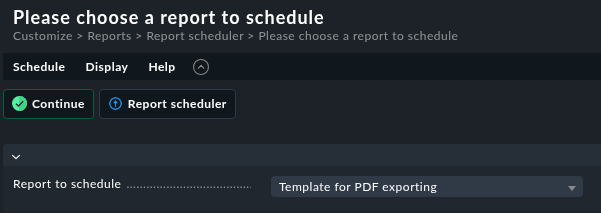
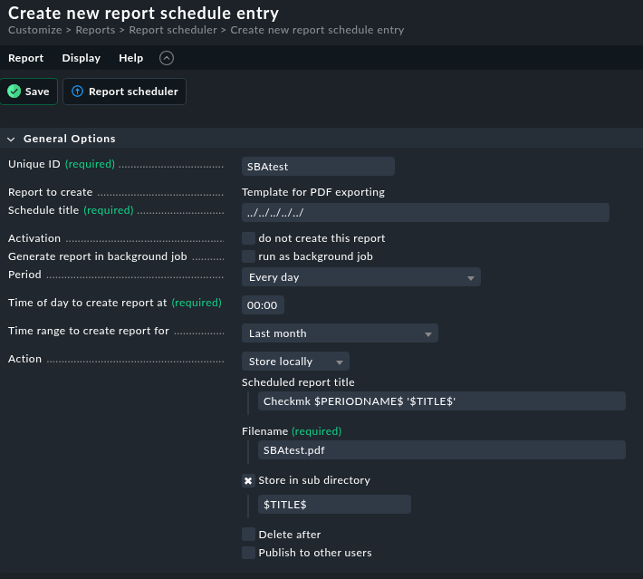
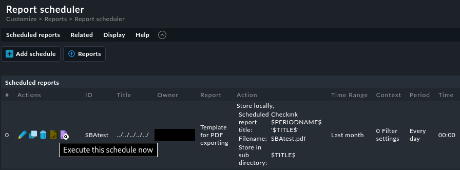
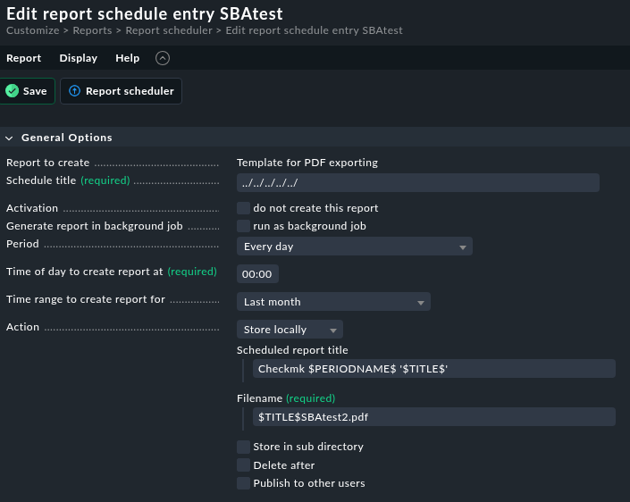

# Checkmk Path Traversal #

## Vulnerability Overview ##

Checkmk in versions before 2.4.0p13, 2.3.0p38 and 2.2.0p46, as well as since
version 2.1.0b1 is prone to a path traversal vulnerability in the report
scheduler. Due to an insufficient validation of a file name input, users can
store reports in arbitrary locations on the server.

* **Identifier**            : SBA-ADV-20250730-01
* **Type of Vulnerability** : Path Traversal
* **Software/Product Name** : [Checkmk](https://github.com/Checkmk/checkmk)
* **Vendor**                : [Checkmk](https://checkmk.com/)
* **Affected Versions**     : < 2.4.0p13, < 2.3.0p38, < 2.2.0p46, => 2.1.0b1
* **Fixed in Version**      : 2.4.0p13, 2.3.0p38, 2.2.0p46
* **CVE ID**                : CVE-2025-39664
* **CVSS Vector**           : CVSS:3.1/AV:N/AC:L/PR:L/UI:N/S:U/C:N/I:L/A:H
* **CVSS Base Score**       : 7.1 (High)

## Vendor Description ##

> Checkmk is a comprehensive IT monitoring system designed for scalability,
> flexibility, and low resource consumption. It supports infrastructure and
> application monitoring across physical, virtual, containerized, and cloud
> environments.

Source: <https://github.com/Checkmk/checkmk>

## Impact ##

An attacker with privileges to schedule reports can write the `.mk` and `.pdf`
file of the report to arbitrary file system paths on the server with the
privileges of the Checkmk service. This could theoretically allow attackers to
gain remote code execution. However, we are not aware of a working exploit
chain, since an attacker can only partially influence the content of the
files. Since a lot of important configuration files use the `.mk` file
extension, a denial-of-service attack is feasible.

## Vulnerability Description ##

Checkmk allows users to schedule report generation and store the generated
reports locally on the server. These reports are usually stored in the
directory `/omd/sites/<site>/var/check_mk/reports/archive/<username>`. A user
can choose the filename and a subdirectory. Although Checkmk checks these
parameters for path traversal attacks, it also allows using variables within
these parameters. The variables are expanded after the path traversal check.
Therefore, attackers with privileges to schedule reports can perform path
traversal attacks by putting the attack vectors in one of the variables. A
report consists of a `.mk` file with the report options and a `.pdf` file with
the report itself. This attack allows writing both files to arbitrary file
system paths on the server with the privileges of the Checkmk service.

## Proof of Concept ##

For exploiting the vulnerability, we use a user with the built-in role `user`,
which has the permission `Manage Own Scheduled Reports` by default. We
navigate to the report scheduler via `Customize > Reports > Report scheduler`
and add a new schedule for an arbitrary report:



We then choose an arbitrary unique ID and an arbitrary filename with `.pdf`
file extension, and place the path traversal vector `../../../../../` in the
schedule title. As subdirectory to store the report, we use `$TITLE$`, which
references the schedule title.



Since we are logged in as the user `lowpriv`, Checkmk would normally store the
report in the directory:
`/omd/sites/site/var/check_mk/reports/archive/lowpriv`
However, due to the path traversal vector, it will be generated in:
`/omd/sites/site`

Currently, there are no reports in this folder:

```bash
OMD[site]:~$ ls -lah /omd/sites/site
total 92K
drwxr-x--x.  9 site site 4.0K Jul 29 16:55 ./
drwxr-xr-x.  3 root root   18 Jun  6 11:28 ../
-rw-------.  1 site site  27K Jul 29 19:55 .bash_history
-rw-r-----.  1 site site 1.1K Jun  6 11:28 .bashrc
drwx------.  3 site site   20 Jun 25 15:08 .config/
-r--------.  1 site site   20 Jun 12 00:00 .erlang.cookie
-rw-------.  1 site site   81 Jul 29 13:59 .lesshst
-rw-r-----.  1 site site 2.7K Jun  6 11:28 .profile
-rw-------.  1 site site   89 Jul 29 16:39 .python_history
drwx------.  2 site site   25 Jul 21 09:43 .ssh/
drwxr-xr-x.  3 site site   57 Jun  6 11:28 .version_meta/
-rw-------.  1 site site  31K Jul 29 16:55 .viminfo
lrwxrwxrwx.  1 site site   11 Jun  6 11:28 bin -> version/bin/
drwxr-x--x. 23 site site 4.0K Jul 29 11:15 etc/
lrwxrwxrwx.  1 site site   15 Jun  6 11:28 include -> version/include/
lrwxrwxrwx.  1 site site   11 Jun  6 11:28 lib -> version/lib/
drwxr-x---.  5 site site   41 Jun  6 11:28 local/
lrwxrwxrwx.  1 site site   13 Jun  6 11:28 share -> version/share/
drwxr-x--x. 12 site site  300 Jul 29 10:11 tmp/
drwxr-x---. 18 site site 4.0K Jul 21 08:45 var/
lrwxrwxrwx.  1 site site   26 Jun  6 11:28 version -> ../../versions/2.4.0p1.cee/
```

We then execute the report schedule by pressing `Execute this schedule now`:



The report files are now stored in the directory `/omd/sites/site` and the
directory `/omd/sites/site/var/check_mk/reports/archive/lowpriv` is still
empty.

```bash hl:15-16
OMD[site]:~$ ls -lah /omd/sites/site
total 176K
drwxr-x--x.  9 site site 4.0K Jul 30 15:05 ./
drwxr-xr-x.  3 root root   18 Jun  6 11:28 ../
-rw-------.  1 site site  27K Jul 29 19:55 .bash_history
-rw-r-----.  1 site site 1.1K Jun  6 11:28 .bashrc
drwx------.  3 site site   20 Jun 25 15:08 .config/
-r--------.  1 site site   20 Jun 12 00:00 .erlang.cookie
-rw-------.  1 site site   81 Jul 29 13:59 .lesshst
-rw-r-----.  1 site site 2.7K Jun  6 11:28 .profile
-rw-------.  1 site site   89 Jul 29 16:39 .python_history
drwx------.  2 site site   25 Jul 21 09:43 .ssh/
drwxr-xr-x.  3 site site   57 Jun  6 11:28 .version_meta/
-rw-------.  1 site site  31K Jul 29 16:55 .viminfo
-rw-rw----.  1 site site  305 Jul 30 15:05 SBAtest.mk
-rw-rw----.  1 site site  79K Jul 30 15:05 SBAtest.pdf
lrwxrwxrwx.  1 site site   11 Jun  6 11:28 bin -> version/bin/
drwxr-x--x. 23 site site 4.0K Jul 29 11:15 etc/
lrwxrwxrwx.  1 site site   15 Jun  6 11:28 include -> version/include/
lrwxrwxrwx.  1 site site   11 Jun  6 11:28 lib -> version/lib/
drwxr-x---.  5 site site   41 Jun  6 11:28 local/
lrwxrwxrwx.  1 site site   13 Jun  6 11:28 share -> version/share/
drwxr-x--x. 12 site site  300 Jul 29 10:11 tmp/
drwxr-x---. 18 site site 4.0K Jul 21 08:45 var/
lrwxrwxrwx.  1 site site   26 Jun  6 11:28 version -> ../../versions/2.4.0p1.cee/

OMD[site]:~$ ls -lah /omd/sites/site/var/check_mk/reports/archive/lowpriv
total 0
drwx------. 2 site site  6 Jul 30 15:05 ./
drwxr-x---. 4 site site 44 Jul 30 15:05 ../
```

It is also possible to include the `$TITLE$` variable containing the path
traversal vector in the filename:



After executing the report schedule again, the report files are also stored in
the directory `/omd/sites/site` and the directory
`/omd/sites/site/var/check_mk/reports/archive/lowpriv` remains empty.

```bash hl:17-18
OMD[site]:~$ ls -lah /omd/sites/site
total 260K
drwxr-x--x.  9 site site 4.0K Jul 30 15:39 ./
drwxr-xr-x.  3 root root   18 Jun  6 11:28 ../
-rw-------.  1 site site  27K Jul 29 19:55 .bash_history
-rw-r-----.  1 site site 1.1K Jun  6 11:28 .bashrc
drwx------.  3 site site   20 Jun 25 15:08 .config/
-r--------.  1 site site   20 Jun 12 00:00 .erlang.cookie
-rw-------.  1 site site   81 Jul 29 13:59 .lesshst
-rw-r-----.  1 site site 2.7K Jun  6 11:28 .profile
-rw-------.  1 site site   89 Jul 29 16:39 .python_history
drwx------.  2 site site   25 Jul 21 09:43 .ssh/
drwxr-xr-x.  3 site site   57 Jun  6 11:28 .version_meta/
-rw-------.  1 site site  31K Jul 29 16:55 .viminfo
-rw-rw----.  1 site site  305 Jul 30 15:05 SBAtest.mk
-rw-rw----.  1 site site  79K Jul 30 15:05 SBAtest.pdf
-rw-rw----.  1 site site  307 Jul 30 15:39 SBAtest2.mk
-rw-rw----.  1 site site  79K Jul 30 15:39 SBAtest2.pdf
lrwxrwxrwx.  1 site site   11 Jun  6 11:28 bin -> version/bin/
drwxr-x--x. 23 site site 4.0K Jul 29 11:15 etc/
lrwxrwxrwx.  1 site site   15 Jun  6 11:28 include -> version/include/
lrwxrwxrwx.  1 site site   11 Jun  6 11:28 lib -> version/lib/
drwxr-x---.  5 site site   41 Jun  6 11:28 local/
lrwxrwxrwx.  1 site site   13 Jun  6 11:28 share -> version/share/
drwxr-x--x. 12 site site  300 Jul 29 10:11 tmp/
drwxr-x---. 18 site site 4.0K Jul 21 08:45 var/
lrwxrwxrwx.  1 site site   26 Jun  6 11:28 version -> ../../versions/2.4.0p1.cee/

OMD[site]:~$ ls -lah /omd/sites/site/var/check_mk/reports/archive/lowpriv
total 0
drwx------. 2 site site  6 Jul 30 15:05 ./
drwxr-x---. 4 site site 44 Jul 30 15:05 ../
```

## Recommended Countermeasures ##

We recommend updating to Checkmk version 2.4.0p13, 2.3.0p38, 2.2.0p46 or
later.

Input values (including used variables) must not be used to construct file
paths without strict validation. Since a validation is already in place, we
recommend using the same validation also after expansion of the variables.
This strict validation should include the normalization (canonicalization) of
the path and the validation that the resulting path points to the allowed
directory.

An ideal solution would be that users cannot influence any part of file system
paths or names. Checkmk could store all reports in a fixed directory structure
(e.g., a single directory), use randomly generated filenames, store the
mapping between the real random filenames and user visible filenames in a
database and deliver the reports with user visible filenames on download.

## Timeline ##

* `2025-07-30` identification of vulnerability in version 2.4.0p1
* `2025-08-01` initial vendor contact via <security@checkmk.com>
* `2025-08-04` disclosed vulnerability to vendor
* `2025-08-04` vendor response with initial assessment
* `2025-08-08` vendor confirmed vulnerability and assigned CVE-2025-39664
* `2025-10-06` vendor pre-announced fix [1]
* `2025-10-09` vendor released fix in versions 2.4.0p13, 2.3.0p38 and 2.2.0p46
* `2025-10-13` public disclosure

## References ##

1. Checkmk. Upcoming Checkmk Security Release 2.4.0p13, 2.3.0p38 and 2.2.0p46:
   <https://forum.checkmk.com/t/upcoming-checkmk-security-release-2-4-0p13-2-3-0p38-and-2-2-0p46/55905>
2. Checkmk. Werk #17984 Path-Traversal in report scheduler:
   <https://checkmk.com/werk/17984>
3. OWASP Web Security Testing Guide. Testing Directory Traversal File Include:
   <https://owasp.org/www-project-web-security-testing-guide/v41/4-Web_Application_Security_Testing/05-Authorization_Testing/01-Testing_Directory_Traversal_File_Include.html>
4. Common Weakness Enumeration. CWE-22 Improper Limitation of a Pathname to a
   Restricted Directory ('Path Traversal'):
   <https://cwe.mitre.org/data/definitions/22.html>

## Credits ##

* Lisa Gnedt ([SBA Research](https://www.sba-research.org/))
