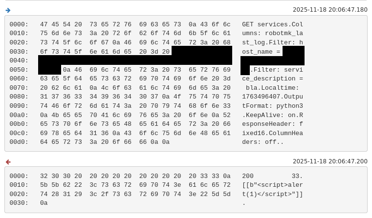
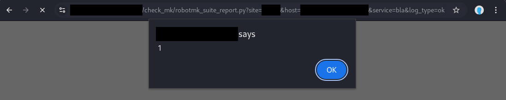

# Checkmk Cross Site Scripting #

## Vulnerability Overview ##

Checkmk in versions before 2.4.0p22 and 2.3.0p43 is prone to a cross-site
scripting (XSS) vulnerability when used in a distributed monitoring setup. Any
connected remote site can inject JavaScript code in the central site's user
interface.

* **Identifier**            : SBA-ADV-20251118-01
* **Type of Vulnerability** : Cross Site Scripting
* **Software/Product Name** : [Checkmk UI](https://github.com/Checkmk/checkmk)
* **Vendor**                : [Checkmk](https://checkmk.com/)
* **Affected Versions**     : < 2.4.0p22, < 2.3.0p43
* **Fixed in Version**      : 2.4.0p22, 2.3.0p43
* **CVE ID**                : CVE-2025-64999
* **CVSS Vector**           : CVSS:3.1/AV:N/AC:L/PR:H/UI:R/S:C/C:H/I:H/A:H
* **CVSS Base Score**       : 8.4 (High)

## Vendor Description ##

> Checkmk is a comprehensive IT monitoring system designed for scalability,
> flexibility, and low resource consumption. It supports infrastructure and
> application monitoring across physical, virtual, containerized, and cloud
> environments.

Source: <https://github.com/Checkmk/checkmk>

## Impact ##

An attacker controlling a connected remote site can take control over web
sessions of victims that visit a specific web page. When attacking an admin
session, this can lead to remote code execution in the central site due to
various available functionalities.

## Vulnerability Description ##

In a distributed monitoring setup, the central Checkmk site pulls logs from
remote sites for Robotmk reports and displays it in the user interface. The
remote site can include HTML content in the logs that is not correctly escaped
in the user interface. Usually, the HTML content is displayed within a
sandboxed iframe not providing access to the origin of the Checkmk UI.
However, when a victim directly opens the link in their browser the scripts
within the HTML content are executed unsandboxed within the origin of the
Checkmk UI. This is problematic if the remote site is not trusted as much as
the central site, for example, because it is operated by a different team or
company or is located in a different security zone.

## Proof of Concept ##

To simulate a malicious remote site, we intercept the Livestatus traffic
between the central and remote site using `mitmproxy`. When the central site
requests the Robotmk logs from the remote site, we replace the empty response
with the XSS vector `<script>alert(1)</script>` using the following
`mitmproxy` script:

```python
from mitmproxy import ctx

def tcp_message(flow):
    if flow.messages[-1].content == b"200           3\n[]\n":
        flow.messages[-1].content = b"200          33\n[[b\"<script>alert(1)</script>\"]]\n"
```

Somewhat similar to a reflected cross-site-scripting attack, a victim must
visit a specific link:

```text
https://omd.site.example/site/check_mk/robotmk_suite_report.py?site=site01&host=winhost1.site01.example&service=bla&log_type=ok
```

This is necessary, since when viewing the report in the usual way via the
Checkmk UI the attack is ineffective since the content is rendered in a
sandboxed iframe. Although that iframe allows JavaScript execution, it runs
within a sandboxed origin that has no access to the Checkmk UI origin.

When visiting the page, the central site fetches the Robotmk logs via
Livestatus from the remote site and the `mitmproxy` script places the XSS
vector in the response (simulating a malicious site):



The central site then delivers the logs including the XSS vector as HTML
content to the victim:

```http
HTTP/1.1 200 OK
Date: Tue, 18 Nov 2025 20:06:47 GMT
X-Content-Type-Options: nosniff
Content-Type: text/html; charset=utf-8
[...]

<script>alert(1)</script>
```

Finally, the victim's browser executes the XSS vector within the origin of the
central sites Checkmk UI:



### Further Exploitation to OS Command Execution ###

Similar to other issues that allow taking over web sessions, if the victim is
an administrator of the central site, it is possible to get code execution on
the server of the central site. For example, by uploading and activating a
malicious extension or by defining a custom data source program via the rule
`Individual program call instead of agent access` (see [1]).

## Recommended Countermeasures ##

We recommend updating to Checkmk version 2.4.0p22, 2.3.0p43 or later.

Checkmk should not allow HTML content from remote sites and instead apply
correct encoding according to the output context. For example, when displaying
the content within an HTML website, HTML encoding must be performed before the
untrusted data is displayed. Relying on client-side measures like sandboxed
iframes is insufficient, if the same web page can also be viewed directly in
the browser.

## Timeline ##

* `2025-11-18` identification of vulnerability in version 2.4.0p15
* `2025-12-04` disclosed vulnerability to vendor via <security@checkmk.com>
* `2025-12-08` vendor acknowledged reception
* `2025-12-19` vendor confirmed vulnerability
* `2026-02-13` vendor assigned CVE-2025-64999
* `2026-02-23` vendor released fix in version 2.4.0p22
* `2026-03-03` vendor released fix in version 2.3.0p43
* `2026-03-04` public disclosure

## References ##

1. SBA Research Security Advisory. SBA-ADV-20250729-01 Checkmk Cross Site
   Scripting. Further Exploitation to OS Command Execution:
   <https://github.com/sbaresearch/advisories/tree/public/2025/SBA-ADV-20250729-01_Checkmk_Cross_Site_Scripting#further-exploitation-to-os-command-execution>
2. Checkmk. Werk #19238: Fix cross-site scripting (XSS) vulnerability in HTML
   logs of Synthetic Monitoring test services:
   <https://checkmk.com/werk/19238>
3. OWASP Cheat Sheet Series. Cross Site Scripting Prevention Cheat Sheet:
   <https://cheatsheetseries.owasp.org/cheatsheets/Cross_Site_Scripting_Prevention_Cheat_Sheet.html>
4. OWASP Web Security Testing Guide (WSTG) v4.2. Testing for Stored Cross Site
   Scripting:
   <https://owasp.org/www-project-web-security-testing-guide/v42/4-Web_Application_Security_Testing/07-Input_Validation_Testing/02-Testing_for_Stored_Cross_Site_Scripting.html>
5. OWASP Application Security Verification Standard (ASVS) v4.0.3. Section 5.3
   Output Encoding and Injection Prevention:
   <https://raw.githubusercontent.com/OWASP/ASVS/v4.0.3/4.0/OWASP%20Application%20Security%20Verification%20Standard%204.0.3-en.pdf>
6. Common Weakness Enumeration. CWE-79 Improper Neutralization of Input During
   Web Page Generation ('Cross-site Scripting'):
   <https://cwe.mitre.org/data/definitions/79.html>

## Credits ##

* Lisa Gnedt ([SBA Research](https://www.sba-research.org/))

The discovery of this vulnerability was made possible through support from
[CYSSDE](https://cyssde.eu/) and the European Union.


