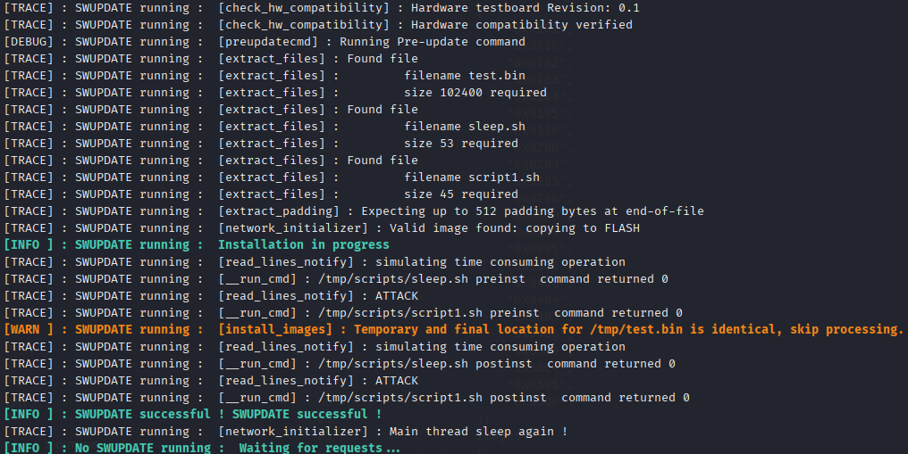
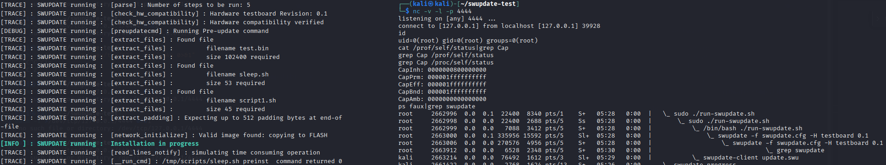

# SWUpdate Untrusted Script Execution via Signed Update TOCTOU #

## Vulnerability Overview ##

SWUpdate before 2026.05 is affected by a time-of-check time-of-use (TOCTOU)
race condition that allows local unprivileged attackers to escalate privileges
to root or install untrusted contents using a signed update.

* **Identifier**            : SBA-ADV-20251206-01
* **Type of Vulnerability** : Privilege Escalation
* **Software/Product Name** : [SWUpdate](https://github.com/sbabic/swupdate)
* **Vendor**                : [SWUpdate](https://swupdate.org/)
* **Affected Versions**     : <= 2026.05
* **Fixed in Version**      : 2026.05
* **CVE ID**                : CVE-2025-41259
* **CVSS Vector**           : CVSS:4.0/AV:L/AC:L/AT:P/PR:L/UI:N/VC:H/VI:H/VA:H/SC:N/SI:N/SA:N
* **CVSS Base Score**       : 7.3 (High)

## Vendor Description ##

> SWUpdate is a Linux Update agent with the goal to provide an efficient and
> safe way to update an embedded Linux system in field.
> SWUpdate supports local and OTA updates, multiple update strategies and
> it is designed with security in mind.

Source: <https://github.com/sbabic/swupdate>

## Impact ##

A local attacker (unprivileged shell user) can abuse the update installation
process to:

* run untrusted code (scripts) in context of the swupdate user
* escalate privileges to root (swupdate user)
* tamper update files within the installation process

All scenarios above are executed via a time-of-check-time-of-use (TOCTOU)
attack on the temporary folder used by SWUpdate.

## Vulnerability Description ##

SWUpdate processes signed update files from disk or the network.
In this example SWUpdate was used to install a signed update from disk.
The update file is a CPIO archive containing a control file (`sw-description`)
and all files necessary to perform an update.
This control file is signed and verified at the start of an update.
It contains the list of files and the control information how to apply an
update file.

In the first step of an update, the contents of the CPIO archive are
extracted to disk and checked for integrity.
SWUpdate uses `/tmp` as a default temporary folder.
During the extraction of the file from the CPIO archive, an integrity
check (hash comparison) is performed for each file individually.

An important circumstance of the exploitability of this vulnerability are
the permissions set on the `/tmp` folder.

```text
drwxrwxrwt 15 root root 360 Dec  4 04:31 /tmp
```

The Sticky Bit assigned to `/tmp` in major Linux distributions allows users
to create directories and own the contents of this newly created folder.
In a benign installation run of SWUpdate the directory is populated as follows:

```text
drwxrwxrwt 9 root root       240 May 29 20:02 /tmp/
srw-rw-rw- 1 root root         0 May 29 18:48 swupdateprog
srw-rw-rw- 1 root root         0 May 29 18:48 sockinstctrl
-rw------- 1 root root       512 May 29 20:10 sw-description.sig
-rw------- 1 root root      9238 May 29 20:10 sw-description
-rw------- 1 root root      1023 May 29 20:10 test.sh
drwxr-xr-x 2 root root       100 May 29 20:10 scripts
```

A folder named `scripts` is created by SWUpdate as place to store
script files (listed in the control file).
The `scripts` folder is owned by root and all subsequent files are assigned
the mode of `rw-------`, meaning that no other user can read files,
nor tamper with those.
After the installation of updates finalizes, the files are purged and the
folder is removed by SWUpdate.

An edge case appears, as a scripts folder is present before the run of SWUpdate.
In this case, SWUpdate reuses the `scripts` folder, and it's mode, owner and group.
This allows an attacker to create this folder in `/tmp` in advance,
controlling its permissions and subsequently its contents.
As SWUpdate populates files during an update in `/tmp/scripts` those are
still only readable by root, but can be moved (renamed) within the directory
by the attacker.
This liberty can be abused to tamper script files with malicious content.

In the second step all updates (listed in `sw-description`) are applied one by
one; this vulnerability focuses on script files executed within updates.
The update files are not rechecked before installation, opening a window of
opportunity for a TOCTOU attack.
The attacker may replace the update file in this timeframe resulting in
installation of untrusted contents.
As the installer process of SWUpdate runs as root user, malicious code could
be executed by the attacker.

## Proof of Concept ##

This example uses a signed update file named `test_signed.swu`.
This update file contains a script file `script1.sh` and a medium-sized file blob.
The `sw-description` has the instruction to install the `script1.sh`.

The attacker prepares a `script` folder in `/tmp`.

```sh
mkdir /tmp/scripts
```

The update process is started using the signed update file.

```sh
swupdate-client test_signed.swu
```

SWUpdate extracts the contents to the temporary folder (`/tmp`).
The attacker runs a constant check if the `/tmp/scripts/script1.sh` exists and
replaces it after a short grace period. The goal is to wait for the extraction
process and the file integrity check to complete.

Now the attacker needs to be in time to overwrite `/tmp/scripts/script1.sh` with
malicious content, before SWUpdate begins to execute the script file.
Larger files that need more time to extract and a sequence of `script1.sh`,
`large.blob` in `sw-description` favours the race condition.



### Privilege Escalation ###

Expanding on the proof of concept above the attacker can take over control of
the process of the executed script file by using a bind shell or reverse shell.



### Installation of Untrusted Contents ###

Since the attacker executes a shell, the installation process is suspended.
At this stage the attacker has full control over the system, but also can
interfere with the contents of the update files.
The log doesn't show evidence of the tampering attempt.

## Recommended Countermeasures ##

We recommend updating to SWUpdate version 2026.05 or later. Furthermore, we
recommend setting the temporary directory (`TMPDIR`) to a separate folder with
a restrictive permission set (`root:root -rwx------`).

### Development ###

* SWUpdate should remove and recreate a `/tmp/scripts` folder.
* SWUpdate could use a randomly named temporary folder (`mktemp`)
* SWUpdate should minimize the time between checking the hash value of an
  update file, and its installation to prevent TOCTOU attacks.
* SWUpdate could remove the files after creation and hold the file descriptor.
  In this case no other process can open the file anymore.

## Timeline ##

* `2025-12-02` discovery and first contact with maintainer
* `2025-12-02` immediate response by the maintainer
* `2025-12-06` sharing of the attack details by SBA Research with the maintainer
* `2026-01-05` fix in SWUpdate repository
* `2026-05-20` start of coordinated disclosure

## References ##

* SWUpdate documentation page: <https://sbabic.github.io/swupdate/swupdate.html>
* Source: <https://github.com/sbabic/swupdate>
* Resolving commit: <https://github.com/sbabic/swupdate/commit/f4bd64260e233e207354d68d572b1cbc3e63689d>
* Common Weakness Enumeration. CWE-367 Time-of-check Time-of-use (TOCTOU) Race
  Condition: <https://cwe.mitre.org/data/definitions/367.html>

## Credits ##

* Reinhard Kugler ([SBA Research](https://www.sba-research.org/))

The discovery of this vulnerability was made possible through support from
[CYSSDE](https://cyssde.eu/) and the European Union.


