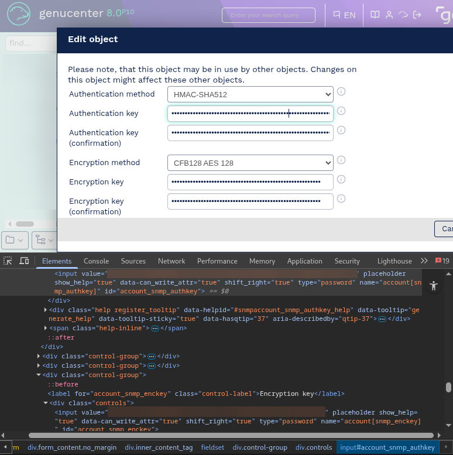

# Genucenter Disclosure of SNMP Credentials #

## Vulnerability Overview ##

The genucenter web interface before version 8.0p11 unnecessarily exposes
sensitive SNMP authentication and encryption keys in its HTTP responses to
users with the “Service” or “Admin” role.
This exposure allows potential unauthorized access to network devices.

* **Identifier**            : SBA-ADV-20260424-01
* **Type of Vulnerability** : Information Disclosure
* **Software/Product Name** : [genucenter](https://www.genua.eu/it-security-solutions/central-management/central-management-station-genucenter)
* **Vendor**                : [genua](https://www.genua.eu/)
* **Affected Versions**     : <= 8.0 Patch 10
* **Fixed in Version**      : 8.0 Patch 11 and 8.6 or later
* **CVE ID**                : CVE-2026-13211
* **CVSS Vector**           : CVSS:3.1/AV:N/AC:L/PR:L/UI:N/S:U/C:L/I:N/A:N
* **CVSS Base Score**       : 4.3 (Medium)

## Vendor Description ##

> genucenter helps you keep a grip on your IT security. The genua security
> solutions can be configured, administrated and continuously monitored using
> the standardized GUI of the central management station.

Source: <https://www.genua.eu/it-security-solutions/central-management/central-management-station-genucenter>

## Impact ##

Exposing sensitive SNMP authentication and encryption keys can allow
unauthorized access to network devices and compromise network security.
An attacker gaining access to these keys could monitor and potentially
control network devices managed via SNMP.

## Vulnerability Description ##

The genucenter web interface unnecessarily returns sensitive data for certain
endpoints. Specifically, when a user with the “Service” or “Admin” role
requests SNMP information, the web interface includes the SNMP authentication
and encryption keys in the HTTP response. These keys should not be accessible
through the web interface. The keys are embedded in the HTML source code of
the response and can be easily extracted using standard browser developer
tools or automated scripts. This over-exposure of data violates the principle
of least privilege and creates a significant security risk.

## Proof of Concept ##

1. Authentication: Authenticate to the genucenter web interface as a user with
   the “Service” or “Admin” role.
2. Request: Navigate to the SNMP information endpoint.
3. Inspection: Inspect the HTML source code of the HTTP response.
4. Observation: Locate the SNMP authentication key and encryption key within
   the HTML source code. These keys will be present as plain text.

Request:

```http
GET /domains/1/accounts/9?dialog=true&dialog_type=edit&data= HTTP/1.1
Host: ███████
Cookie: _session_id=███████████████████████████
[...]
```

Response:

```http
HTTP/1.1 200 OK
Content-Type: text/html; charset=utf-8
[...]
<div class="control-group"><label for="account_snmp_authkey" class="control-label">Authentication key</label><div class="controls"><input value="█████████████████████████████████████████████████" placeholder="" show_help="true" data-can_write_attr="true" shift_right="true" type="password" name="account[snmp_authkey]" id="account_snmp_authkey" /></div><div class="help register_tooltip" data-helpid="#snmpaccount_snmp_authkey_help" data-tooltip="generate_help" data-tooltip-sticky="true"><div id="snmpaccount_snmp_authkey_help" class="help-text"><p>Key used by authentication method.</p></div></div><span class="help-inline"><span class="errors"></span> <span class="warnings"></span></span></div>
  <div class="control-group"><label for="account_snmp_authkey_confirmation" class="control-label">Authentication key (confirmation)</label><div class="controls"><input value="█████████████████████████████████████████████████" placeholder="" show_help="true" data-can_write_attr="true" shift_right="true" type="password" name="account[snmp_authkey_confirmation]" id="account_snmp_authkey_confirmation" /></div><div class="help register_tooltip" data-helpid="#snmpaccount_snmp_authkey_confirmation_help" data-tooltip="generate_help" data-tooltip-sticky="true"><div id="snmpaccount_snmp_authkey_confirmation_help" class="help-text"><p>Repeat the authentication key.</p></div></div><span class="help-inline"><span class="errors"></span> <span class="warnings"></span></span></div>
[...]
  <div class="control-group"><label for="account_snmp_enckey" class="control-label">Encryption key</label><div class="controls"><input value="█████████████████████████████████████████████████" placeholder="" show_help="true" data-can_write_attr="true" shift_right="true" type="password" name="account[snmp_enckey]" id="account_snmp_enckey" /></div><div class="help register_tooltip" data-helpid="#snmpaccount_snmp_enckey_help" data-tooltip="generate_help" data-tooltip-sticky="true"><div id="snmpaccount_snmp_enckey_help" class="help-text"><p>Key for encryption method.</p></div></div><span class="help-inline"><span class="errors"></span> <span class="warnings"></span></span></div>
  <div class="control-group"><label for="account_snmp_enckey_confirmation" class="control-label">Encryption key (confirmation)</label><div class="controls"><input value="█████████████████████████████████████████████████" placeholder="" show_help="true" data-can_write_attr="true" shift_right="true" type="password" name="account[snmp_enckey_confirmation]" id="account_snmp_enckey_confirmation" /></div><div class="help register_tooltip" data-helpid="#snmpaccount_snmp_enckey_confirmation_help" data-tooltip="generate_help" data-tooltip-sticky="true"><div id="snmpaccount_snmp_enckey_confirmation_help" class="help-text"><p>Repeat encryption key.</p></div></div><span class="help-inline"><span class="errors"></span> <span class="warnings"></span></span></div>
[...]
```



This demonstrates the vulnerability as sensitive keys are directly exposed to
any user with access to view the page source.

## Recommended Countermeasures ##

Remove any sensitive information, such as authentication keys, encryption
keys, passwords, or other secrets, before sending the response to the client.

## Timeline ##

* `2026-04-24` Disclosed vulnerability identified in version 8.0 Patch 10 to
               vendor
* `2026-04-24` Initial vendor response
* `2026-05-05` Vendor confirmed vulnerability for version 8.0; version 8.1 to
               8.5 are already out of support; version 8.6 or later are not
               affected
* `2026-06-24` SBA assigned CVE-2026-13211
* `2026-07-01` Vendor released version 8.0 Patch 11 to fix the vulnerability
* `2026-07-01` Public disclosure

## References ##

1. OWASP Top 10. A01:2025 Broken Access Control:
   <https://owasp.org/Top10/2025/A01_2025-Broken_Access_Control/>
2. Common Weakness Enumeration. CWE-201 Insertion of Sensitive Information
   Into Sent Data: <https://cwe.mitre.org/data/definitions/201.html>

## Credits ##

* Andreas Boll ([SBA Research](https://www.sba-research.org/))
* Lisa Gnedt ([SBA Research](https://www.sba-research.org/))

The discovery of this vulnerability was made possible through support from
[CYSSDE](https://cyssde.eu/) and the European Union.


